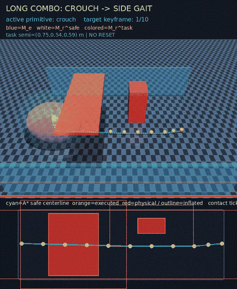
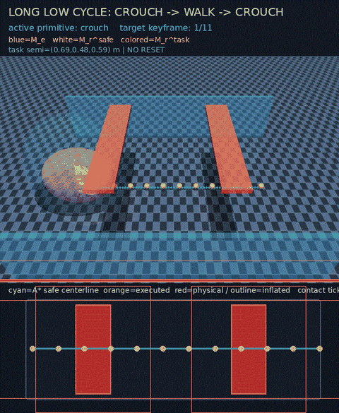
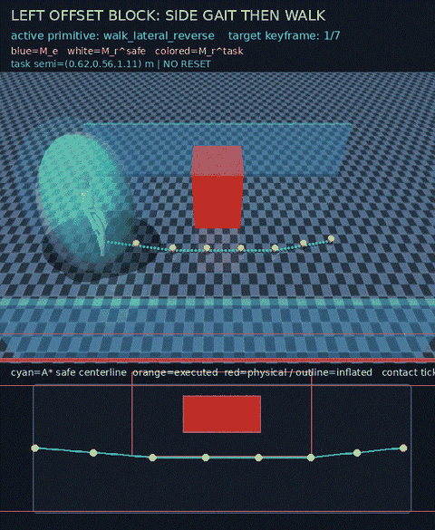

# Visual demo gallery

These previews are generated only from accepted MuJoCo reports. They are compact GitHub
previews; the full-resolution GIF, NPZ trajectory, candidate audit and JSON metrics remain in
`reports/manifold_motion/` after reproduction.

## Online closed loop


Continuous 2.5 Hz radar frames update the global 3-D probability grid while the robot moves.
Incremental ESDF and D* Lite repair the route, construct the local ellipsoid corridor `M_e(t)`,
and request a new primitive. A candidate is committed only after a current-state/history shadow
rollout passes the MuJoCo contact and exact self-manifold clearance gates.

Pilot result: 11/11 keyframes, 18 online map updates, three safe semantic commits, zero obstacle
contacts, 0.152 m route-deviation P95 and 0.187 m minimum runtime self-manifold clearance.

## Dynamic map changes


The obstacle appears, crosses the route and disappears. The route changes four times. Median
post-initialization update time is 27.1 ms for incremental ESDF + D* Lite versus 2.14 s for the
previous full voxel A* implementation on this machine.

## Synchronized dynamic MuJoCo rollout


This is the complete physical chain rather than a map-only animation. A centre block is present
for the first 200 control ticks and then disappears. The same timestamped pose drives MuJoCo
contacts, simulated radar, the 3-D probability map, D* Lite, the rendered obstacle and the exact
G1 self-manifold audit. The Ours-4 seed-31000 pilot reaches 10/10 keyframes in 363 ticks with
zero obstacle contacts, 0.219 m terminal error, 0.168 m route-deviation P95 and 0.055 m minimum
exact surface clearance. There are 19 online map/planner updates. See
[`docs/dynamic_route_reopen_pilot.json`](docs/dynamic_route_reopen_pilot.json); these are
one-seed adapter checks, not final CVPR statistics.

## Compound long-horizon task



One continuous MuJoCo state crosses several route/manifold regions. The colored task manifold
changes with the selected primitive; the measured safe self-manifold remains the collision gate.

## Repeated low-clearance task



Crouch transitions are tied to the measured vertical corridor aperture, including the transition
back to nominal locomotion after leaving the constrained interval.

## Counterfactual environment test


The route and initial robot state are paired while the aperture changes. This is the visual
counterfactual for the claim that the action changes because of `M_e`, rather than because of a
hard-coded route-segment token.

## Side-on obstacle passage



The local lateral aperture requests side gait before the constrained region and returns to nominal
walking after clearance recovers.

## Primitive behavior matrix


The same routing contract is shown for wide, low, narrow and obstacle-curved scenes. The selected
primitive changes with the measured aperture and route curvature, not with a segment index.

## Flow candidates on a blocked route


Multiple conditional references are generated for each route segment and screened by the exact
SONIC/MuJoCo gate before one candidate is committed.

## Transition into crouch without reset


The bridge is evaluated in one continuous simulator state; the transition is not a concatenation
of separately reset clips.

## Jump and landing


This accepted high-amplitude primitive records airborne ticks and a verified landing while keeping
non-foot floor contacts and obstacle contacts at zero.

## Phase-matched jump to crouch


This accepted 220-tick, no-reset sequence uses a phase-matched low-transition clip between a
high-amplitude jump and a crouched gait. The two handoff RMS errors are 0.488 and 0.280 rad;
lift is 0.255 m, landing is verified, and obstacle/non-foot contacts are zero. It demonstrates
controller handoff capability only: jump-over obstacle routing remains opt-in until a
corridor-conditioned jump is trained and gated.

## Long side and low-clearance sequences


These are longer no-reset sequences for side-on and crouch gait. The measured self-manifold gate
remains active throughout the constrained intervals.

## Extended compound and multi-turn tasks


The chicane reaches 17 keyframes and activates nine curvature-caused turn intervals; unilateral
obstacles keep its base primitive nominal rather than falsely requesting side gait. The compound
route reaches 18 keyframes and changes from crouch under the low lintel to lateral gait in the
narrow passage, then uses turn assistance around the offset block before recovering nominal gait.
Both runs have zero obstacle-contact ticks.


The gate cycle exercises `crouch → walk → crouch → side → crouch → walk` over 15 keyframes.
The slalom reaches 18 keyframes, uses three bilateral side intervals and activates nine latched
turn intervals while alternating around four obstacles. These are one-state executions; the
simulator is not reset at primitive boundaries.
The exact G1-surface clearance gate and the changing task/self manifolds remain visible in every
clip.

The compact machine-readable acceptance summary is
[`docs/demo_gallery/extended_acceptance.json`](docs/demo_gallery/extended_acceptance.json).

## Reproduce the previews

First run the corresponding acceptance demos, then build the compact previews:

```bash
./run_stage2_extended_gallery.sh
PYTHONPATH=. python3 -m manifold_motion.build_github_demo_gallery

# Re-render an accepted saved rollout without rerunning the controller:
PYTHONPATH=. MUJOCO_GL=egl python3 -m manifold_motion.render_stage2_report \
  --run-dir reports/cvpr/dynamic_reopen_pilot/runs/6851b4b0cfca2000/rollout \
  --out docs/demo_gallery/media/dynamic_route_reopen.gif --fps 10 --scale 0.75
```

`docs/demo_gallery/media/manifest.json` records each source clip, sampling stride, output size and
SHA-256. Preview generation does not run a rollout and cannot convert a failed trial into evidence.
The paper results must be generated by the predeclared multi-seed benchmark in
[`CVPR_EXPERIMENTS.md`](CVPR_EXPERIMENTS.md), not selected from this gallery.
