# Manifold-Motion

Research harness for **manifold-conditioned motion generation** on a Unitree G1, executed by a
frozen whole-body controller (NVIDIA GEAR-SONIC ONNX) in MuJoCo.

The idea: an environment constraint is expressed as an **ellipsoid manifold** the body must stay
inside, and the policy learns what to do about it. The static `M → pose` stage is retained as
Stage 1; the current runnable Stage 2 adds `M_e(t) + state/history → motion` with candidate
screening, projection, and continuous SONIC/MuJoCo execution.

Renamed from `Sonic-Nav`, which described the parent project rather than this one. The repository
is trimmed to the research-essential subset — `manifold_motion/` plus the SONIC ONNX assets it
loads; navigation, deployment source and training stacks from the original Sonic-Nav /
GR00T-WholeBodyControl trees were removed.

## Where to start

| document | what it covers |
|---|---|
| [`ARCHITECTURE.md`](ARCHITECTURE.md) | **the whole system**: environment → manifold → primitive → dynamic motion → SONIC, both stages, the capability manifold, the reverse-data loops, the frozen interfaces, and the nine phases with their acceptance criteria |
| [`ARCHITECTURE_CURRENT.md`](ARCHITECTURE_CURRENT.md) | **current runnable architecture**: online state/history, Flow candidates, optimization-embedded projection, SONIC/MuJoCo physical gate, and the `center/low/narrow/wide` reproducibility assets |
| [`PIPELINE.md`](PIPELINE.md) | **what is built**: only Phase 1–3 (`M → pose`, no time dimension) — the three stages, their measured numbers, the bugs that were fixed, what is still unsolved |
| [`STAGE2.md`](STAGE2.md) | **the dynamic-data implementation**: selected BONES-SEED G1 CSV → frozen SONIC replay/gate → actor-disjoint windows → bounded latent Flow Matching → SONIC validation |
| [`ROADMAP.md`](ROADMAP.md) | **the current boundary and next algorithmic gates**: what is physically verified, what still uses anchors, and the order of the remaining work |
| [`STAGE2_DIVERSE_DEMOS.md`](STAGE2_DIVERSE_DEMOS.md) | **additional visual cases**: short-low, left-offset-block, and right-offset-block action changes |
| [`STAGE2_LONG_SEQUENCES.md`](STAGE2_LONG_SEQUENCES.md) | **long-horizon cases**: repeated manifold changes in one continuous rollout |
| [`DEMO_GALLERY.md`](DEMO_GALLERY.md) | **GitHub visual gallery**: online SLAM, dynamic obstacles, long-horizon compound tasks, counterfactual and side-on passage |
| [`CVPR_EXPERIMENTS.md`](CVPR_EXPERIMENTS.md) | **paper experiment protocol**: hypotheses, paired baselines, ablations, robustness, statistics and artifact policy |
| [`CVPR_PILOT_RESULTS.md`](CVPR_PILOT_RESULTS.md) | **latest pilot evidence**: re-run side/low/center fixtures and dynamic replanning timing |

### Stage-2 GUI

To open the accepted independent normal-walking result in the WSLg MuJoCo window, run
`run_stage2_gui.ps1` from PowerShell, or follow the GUI command in [`STAGE2.md`](STAGE2.md).
The viewer shows the actual SONIC/MuJoCo execution together with the generated reference,
held-out SEED reference, and conditioned corridor; it is not a kinematic teleport demo.
For Windows Remote Desktop sessions that show a white `COPY MODE` surface, run
`run_stage2_render.ps1`; it creates and opens `stage2_walk_effect.gif` using offscreen EGL rendering.
For a reproducible training-effect check, run `run_stage2_comparison.ps1`; for the full five-window
residual-Flow gate, run `run_stage2_acceptance.ps1`.
`run_stage2_residual_comparison.ps1` renders a three-panel GIF with a stochastic residual candidate.
For the clearest before/after evidence, run `run_stage2_effect_dashboard.ps1`; it plots SEED,
generated-reference, and actual-execution paths for the same held-out window.
`run_stage2_no_handcrafted_anchor.sh` runs the raw-anchor ablation (wide/low are expected to
pass; a narrow side-step rejection is recorded rather than hidden). After generating the
generalisation archive, `run_stage2_exec_target_ablation.sh` trains execution-target conditional
means for the frozen SONIC tracking-error ablation.
For additional environment-to-action visuals, run `run_stage2_diverse_demo.ps1` from PowerShell
or `./run_stage2_diverse_demo.sh` in WSL. It renders short-low, left-offset-block, and
right-offset-block scenes with crouch/side/turn route decisions.
For long-horizon tasks, run `run_stage2_long_sequence_demo.ps1` or
`./run_stage2_long_sequence_demo.sh`; these keep one MuJoCo state while crossing multiple
manifold regions.
`./run_stage2_extended_gallery.sh` adds four longer tasks that are not variants of the original
center/low/narrow/wide fixtures: an alternating chicane, a low-to-side-to-turn compound route,
a repeated low/side gate cycle, and a multi-turn slalom.

### Visual results (accepted MuJoCo + SONIC simulations)

These compact previews are checked into the repository so they render directly below this README
on GitHub. They are generated only from accepted reports; the full-resolution clips and metrics
remain in the reproducibility artifacts.

<p>
  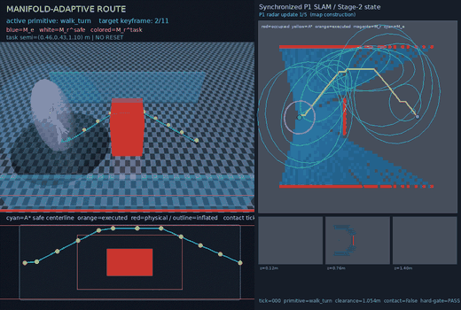
  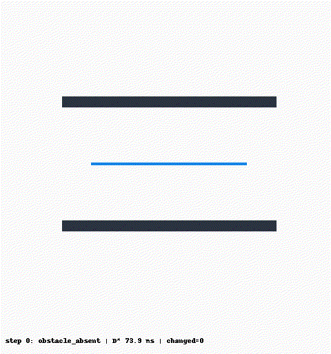
</p>
<p>
  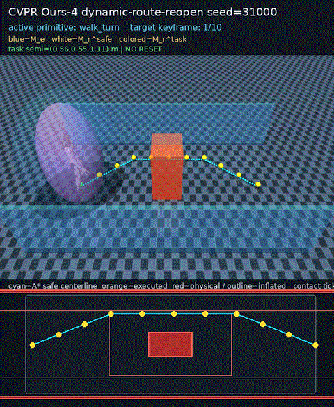
</p>
<p>
  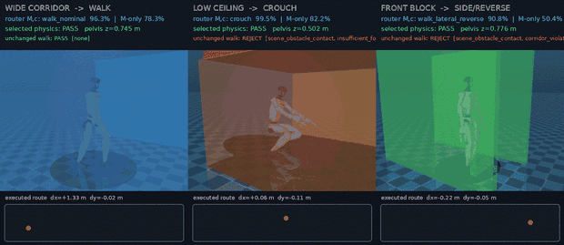
  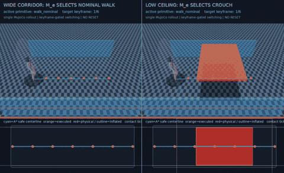
</p>
<p>
  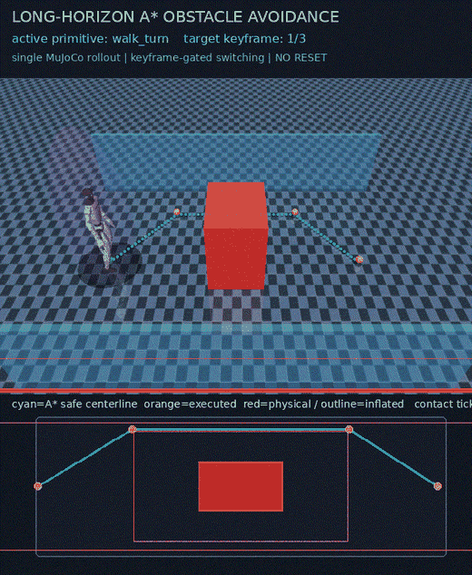
  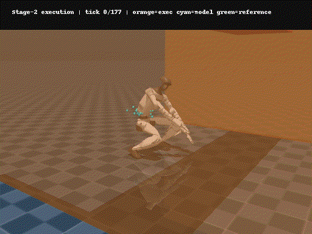
</p>
<p>
  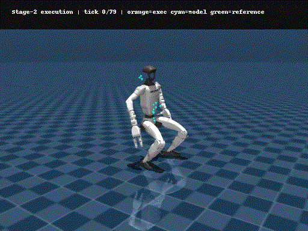
  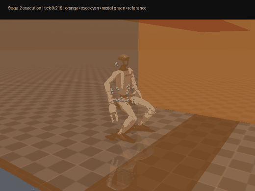
  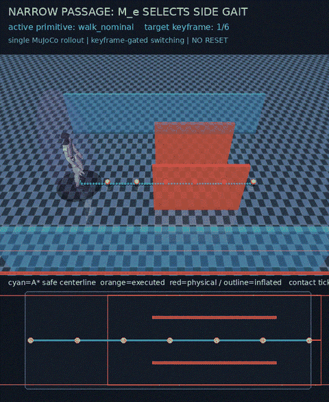
  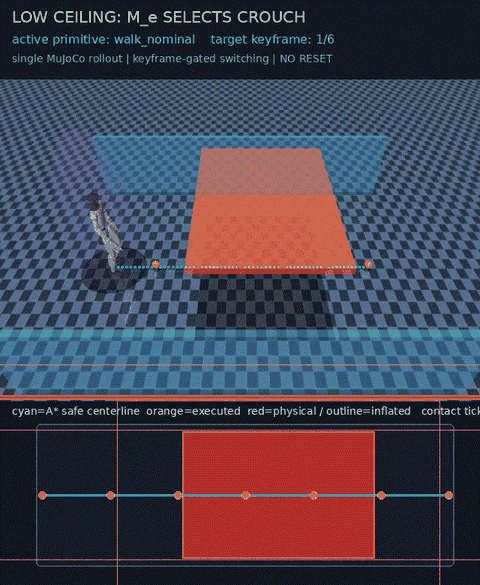
</p>

#### Extended long-sequence tasks

<p>
  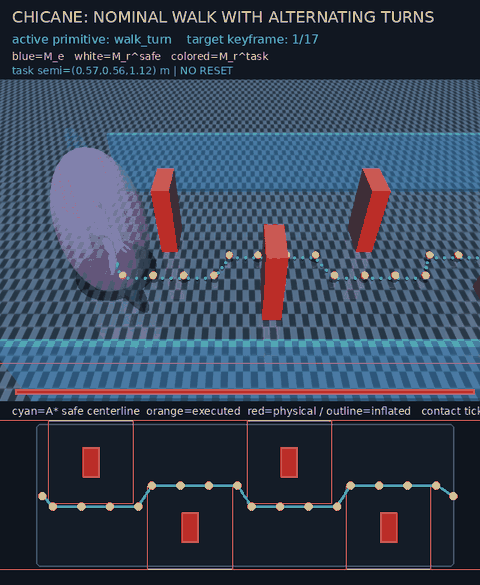
  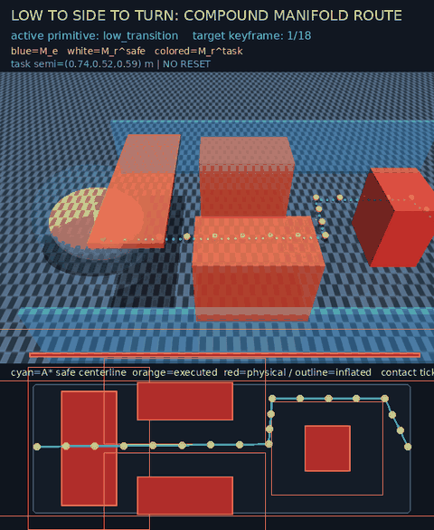
</p>
<p>
  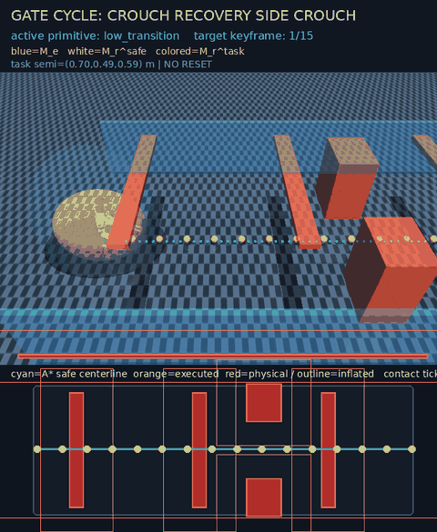
  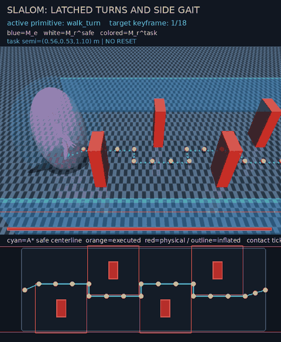
</p>

All four extended tasks pass the same continuous MuJoCo/SONIC gate with zero obstacle-contact
ticks. They reach 17, 18, 15 and 18 keyframes respectively. Chicane uses nominal walking plus
curvature turns; the slalom uses nominal walking, three bilateral side-gait intervals and
curvature turns. Low-side-turn additionally includes explicit low-clearance transition helpers.
Every primitive sequence is derived from measured aperture and route curvature, not from a
scripted segment schedule.
The machine-readable acceptance rows are in [`docs/demo_gallery/extended_acceptance.json`](docs/demo_gallery/extended_acceptance.json).

See [`DEMO_GALLERY.md`](DEMO_GALLERY.md) for the complete list, scenario descriptions and
reproduction command. The quantitative pilot log is [`CVPR_PILOT_RESULTS.md`](CVPR_PILOT_RESULTS.md).
The 104-row primary adapter preflight is summarized in
[`docs/cvpr_primary_smoke_report.json`](docs/cvpr_primary_smoke_report.json); it is explicitly
structural-only and is not paper statistics.

### Deploy perception demo

The `deploy` branch adds a reproducible perception loop: MuJoCo radar returns are fused into a
global-coordinate 3-D probabilistic voxel grid. Incremental truncated ESDF and D* Lite plan on a
ground-bound projection while the full 3-D map supplies vertical clearance and a root-local 3-D
ellipsoidal safe corridor. Run
`run_deploy_perception_demo.ps1` (or `./run_deploy_perception_demo.sh` in WSL) and inspect
the synchronized GIF linked from [`DEMO_GALLERY.md`](DEMO_GALLERY.md). Coordinate contracts and the real-sensor
replacement points are documented in [`DEPLOY_PERCEPTION.md`](DEPLOY_PERCEPTION.md). The deploy
layer supplies the P1 condition input; the same primitive router, Stage-2 generator, SONIC hard
gate and MuJoCo executor continue to run while new radar frames arrive.
The dynamic route-reopen preview above uses one timestamped obstacle schedule in the physical
MuJoCo world, radar world, probability map, renderer and exact self-manifold audit. Its one-seed
pilot reaches 10/10 keyframes with zero obstacle contacts; it is adapter evidence, not a final
multi-seed paper result.

Start with `ARCHITECTURE_CURRENT.md` and `STAGE2_STATUS.md` for the current runnable closed loop.
`ARCHITECTURE.md` and `PIPELINE.md` retain the original design history and static-stage diagnosis;
they are not the authoritative statement that Stage-2 is absent. `ROADMAP.md` records the
remaining generalisation work.

## Layout

| Path | Contents |
|---|---|
| `manifold_motion/` | MuJoCo environment, frozen SONIC controller, manifold family, behaviour cloning, in-the-loop fine-tune, viewers |
| `gear_sonic_deploy/policy/release/` | SONIC encoder/decoder ONNX + observation config (downloaded, git-ignored) |
| `data/` | G1 MuJoCo model, meshes, generated manifold scenes (git-ignored) |
| `reports/` | Clips, demonstrations, checkpoints, verification JSON (git-ignored — **back these up separately**) |

## Setup

```bash
python3 -m pip install -r requirements.txt
python3 download_from_hf.py --stage2-only  # Stage-2 encoder/decoder/config; skip the large planner
```

The G1 model and meshes live in `data/g1_flat/`.

## Run

Three stages, each judged by its own metric:

```bash
# ① data
python3 -m manifold_motion.dataset show                # health: speed, envelope, coverage
python3 -m manifold_motion.demo_spread                 # how much recorded poses vary per manifold

# ② the clone
make g1-bc-train                                   # or: python3 -m manifold_motion.bc train
make g1-bc-eval                                    # 94.9% of training manifolds fit

# ③ the in-the-loop fine-tune
make g1-sonic-rl                                   # ~15 min on CPU
make g1-sonic-eval                                 # BC vs fine-tuned, on the real controller

# verification and the containment ruler
make g1-verify                                     # 6/10 inside, r(sonic) median 0.976
make g1-ruler                                      # the ellipsoid-vs-box check

# see it
python3 -m manifold_motion.view_data replay            # ① the recording
python3 -m manifold_motion.show_bc                     # ② the clone on its training manifolds
python3 -m manifold_motion.show_rl                     # ③ the fine-tune; keys reshape the manifold
```

Viewer keys and what each number on screen means: [`PIPELINE.md`](PIPELINE.md) §7.

## Current numbers

| stage | metric | value |
|---|---|---|
| ① data | SONIC tracking error | 0.054 rad (137 clips, 18705 windows, 10336 pose pairs) |
| ② clone | pose inside its recorded envelope | 9336/9840 = **94.9%** |
| ③ in-loop | achieved pose inside the perturbed envelope | success **1.00**, r **0.82** |
| gate | `verify_sonic` | **6/10** inside, r(sonic) median 0.976 |

The current four-scene online projection regression is recorded in
`reports/manifold_motion/stage2_online_projection_v1/comparison_report.json` and is separate
from the older static `verify_sonic` gate above.

## Known blocker

Tilted and very narrow manifolds (`report_specs` t=±10) sit at r 1.12–1.33. Diagnosed: the
manifolds are geometrically solvable (a body pitched 7–8° fits at r 0.97), the policy responds
in the right direction but with about half the needed amplitude, and training on tilted
manifolds makes things **worse** rather than better — the policy answers with waist pitch, which
the frozen controller does not follow. The fix is a pose channel the controller tracks
(`vr_3point_local_target`), not more training pressure. Details: [`PIPELINE.md`](PIPELINE.md) §6.
