# Manifold-Motion

Research harness for **manifold-conditioned motion generation** on a Unitree G1, executed by a
frozen whole-body controller (NVIDIA GEAR-SONIC ONNX) in MuJoCo.

The idea: an environment constraint is expressed as an **ellipsoid manifold** the body must stay
inside, and the policy learns what to do about it. The static `M → pose` stage is retained as
Stage 1; the current runnable Stage 2 adds `M_e(t) + state/history → motion` with candidate
screening, projection, and continuous SONIC/MuJoCo execution.

Renamed from `Sonic-Nav`, which described the parent project rather than this one. The repository
is trimmed to the research-essential subset — `manifold_motion/` plus the SONIC ONNX assets it
loads; navigation, deployment source and training stacks from the original Sonic-Nav /
GR00T-WholeBodyControl trees were removed.

## Where to start

| document | what it covers |
|---|---|
| [`ARCHITECTURE.md`](/docs/architecture/ARCHITECTURE.md) | **the whole system**: environment → manifold → primitive → dynamic motion → SONIC, both stages, the capability manifold, the reverse-data loops, the frozen interfaces, and the nine phases with their acceptance criteria |
| [`ARCHITECTURE_CURRENT.md`](/docs/architecture/CURRENT.md) | **current runnable architecture**: online state/history, Flow candidates, optimization-embedded projection, SONIC/MuJoCo physical gate, and the `center/low/narrow/wide` reproducibility assets |
| [`PIPELINE.md`](/docs/architecture/PIPELINE.md) | **what is built**: only Phase 1–3 (`M → pose`, no time dimension) — the three stages, their measured numbers, the bugs that were fixed, what is still unsolved |
| [`STAGE2.md`](/docs/stage2/STAGE2.md) | **the dynamic-data implementation**: selected BONES-SEED G1 CSV → frozen SONIC replay/gate → actor-disjoint windows → bounded latent Flow Matching → SONIC validation |
| [`SEED_CAPABILITY.md`](/docs/stage2/SEED_CAPABILITY.md) | **the 30-family capability gate**: metadata retrieval → actor-disjoint slice → MuJoCo/SONIC physical admission → positive/negative evidence |
| [`ONLINE_COMPOSER.md`](/docs/stage2/ONLINE_COMPOSER.md) | **live high-level composition**: rolling SLAM `M_e`, measured `M_self`, state/history, 21-family inference, hysteresis and geometry safety override |
| [`LATENT_SKILL_PRIOR.md`](/docs/stage2/LATENT_SKILL_PRIOR.md) | **actual environment-conditioned latent execution**: `target_exec` prior, latent barrier, candidate screening and the multi-skill MuJoCo atlas |
| [`ROADMAP.md`](/docs/ROADMAP.md) | **the current boundary and next algorithmic gates**: what is physically verified, what still uses anchors, and the order of the remaining work |
| [`STAGE2_DIVERSE_DEMOS.md`](/docs/stage2/DIVERSE_DEMOS.md) | **additional visual cases**: short-low, left-offset-block, and right-offset-block action changes |
| [`STAGE2_LONG_SEQUENCES.md`](/docs/stage2/LONG_SEQUENCES.md) | **long-horizon cases**: repeated manifold changes in one continuous rollout |
| [`DEMO_GALLERY.md`](/docs/demo_gallery/README.md) | **GitHub visual gallery**: online SLAM, dynamic obstacles, long-horizon compound tasks, counterfactual and side-on passage |
| [`CVPR_EXPERIMENTS.md`](/docs/experiments/CVPR_EXPERIMENTS.md) | **paper experiment protocol**: hypotheses, paired baselines, ablations, robustness, statistics and artifact policy |
| [`CVPR_PILOT_RESULTS.md`](/docs/experiments/CVPR_PILOT_RESULTS.md) | **latest pilot evidence**: re-run side/low/center fixtures and dynamic replanning timing |

### Stage-2 GUI

To open the accepted independent normal-walking result in the WSLg MuJoCo window, run
`scripts/run_stage2_gui.ps1` from PowerShell, or follow the GUI command in [`STAGE2.md`](/docs/stage2/STAGE2.md).
The viewer shows the actual SONIC/MuJoCo execution together with the generated reference,
held-out SEED reference, and conditioned corridor; it is not a kinematic teleport demo.
For Windows Remote Desktop sessions that show a white `COPY MODE` surface, run
`scripts/run_stage2_render.ps1`; it creates and opens `stage2_walk_effect.gif` using offscreen EGL rendering.
For a reproducible training-effect check, run `scripts/run_stage2_comparison.ps1`; for the full five-window
residual-Flow gate, run `scripts/run_stage2_acceptance.ps1`.
`scripts/run_stage2_residual_comparison.ps1` renders a three-panel GIF with a stochastic residual candidate.
For the clearest before/after evidence, run `scripts/run_stage2_effect_dashboard.ps1`; it plots SEED,
generated-reference, and actual-execution paths for the same held-out window.
`scripts/run_stage2_no_handcrafted_anchor.sh` runs the raw-anchor ablation (wide/low are expected to
pass; a narrow side-step rejection is recorded rather than hidden). After generating the
generalisation archive, `scripts/run_stage2_exec_target_ablation.sh` trains execution-target conditional
means for the frozen SONIC tracking-error ablation.
For additional environment-to-action visuals, run `scripts/run_stage2_diverse_demo.ps1` from PowerShell
or `./scripts/run_stage2_diverse_demo.sh` in WSL. It renders short-low, left-offset-block, and
right-offset-block scenes with crouch/side/turn route decisions.
For long-horizon tasks, run `scripts/run_stage2_long_sequence_demo.ps1` or
`./scripts/run_stage2_long_sequence_demo.sh`; these keep one MuJoCo state while crossing multiple
manifold regions.
`./scripts/run_stage2_extended_gallery.sh` adds four longer tasks that are not variants of the original
center/low/narrow/wide fixtures: an alternating chicane, a low-to-side-to-turn compound route,
a repeated low/side gate cycle, and a multi-turn slalom.
`./scripts/run_stage2_online_composer_long.sh` evaluates the 21-family composer on held-out rolling
windows and executes three online-radar long routes with `M_e + M_self + state/history` routing.
For the clearest causal visualization, run `./scripts/render_stage2_online_composer_counterfactual.sh`;
it pairs the same long task under a wide manifold and a low manifold so the walk-to-crouch change
is visible rather than hidden in a single route replay.
For the first non-router LATENT execution audit, run the v6 prior training command and then the
candidate probe documented in [`LATENT_SKILL_PRIOR.md`](/docs/stage2/LATENT_SKILL_PRIOR.md). The
checked-in atlas below shows eight distinct decoded skill families after the frozen SONIC/MuJoCo
mesh gate; it is deliberately separate from the older deterministic wide/low counterfactual.

### Visual results (accepted MuJoCo + SONIC simulations)

These compact previews are checked into the repository so they render directly below this README
on GitHub. They are generated only from accepted reports; the full-resolution clips and metrics
remain in the reproducibility artifacts.

<p>
  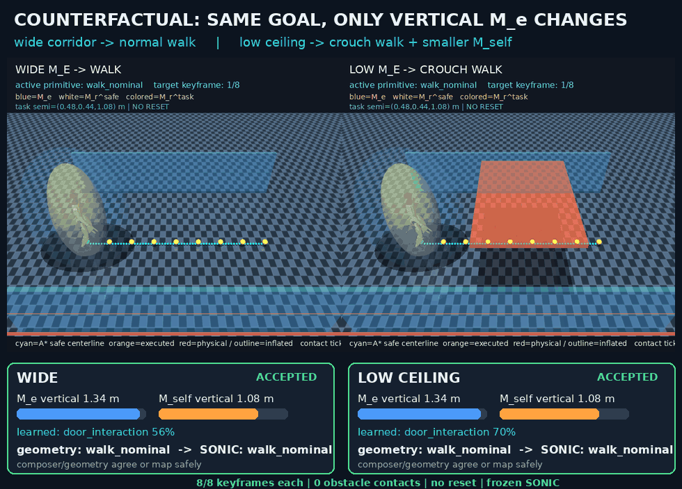
</p>
<p>
  
</p>
<p>
  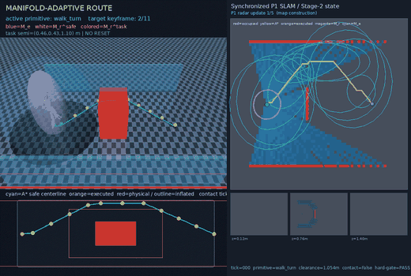
  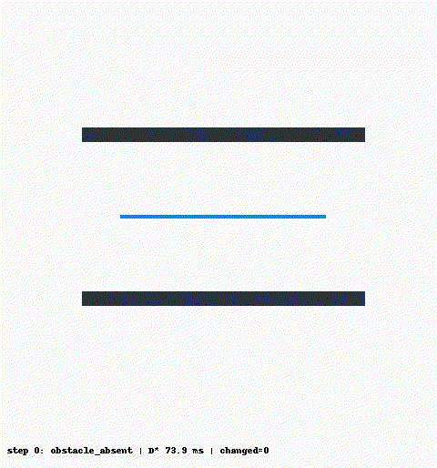
</p>
<p>
  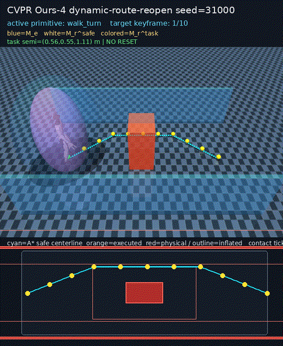
</p>
<p>
  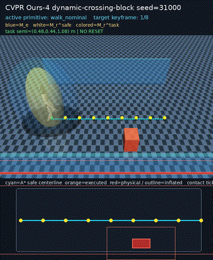
  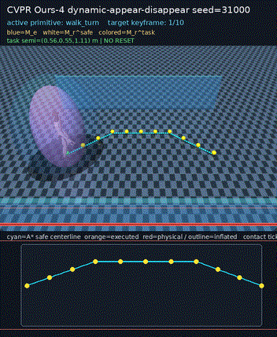
  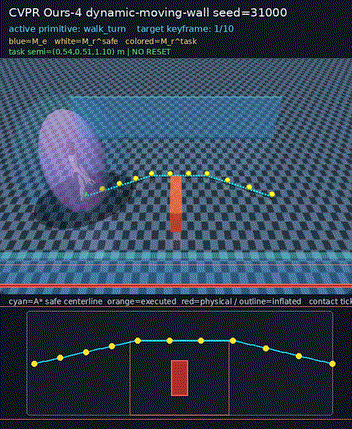
</p>
<p>
  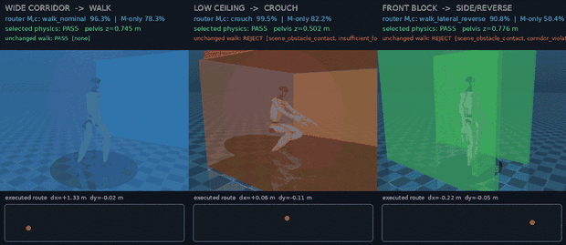
  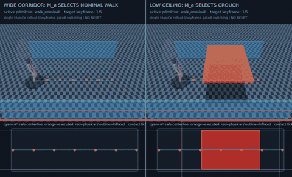
</p>
<p>
  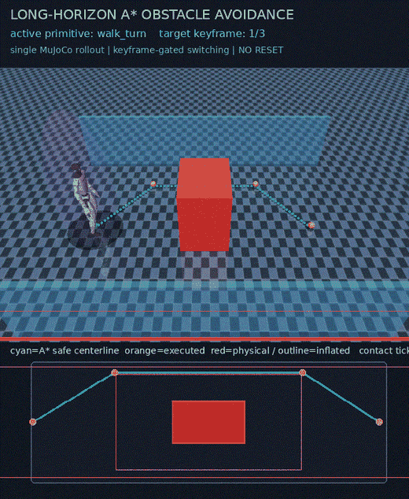
  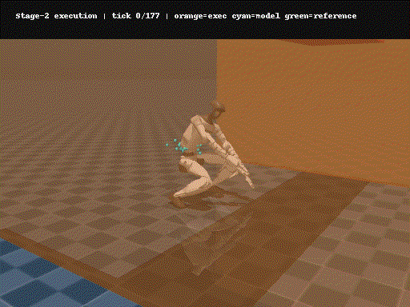
</p>
<p>
  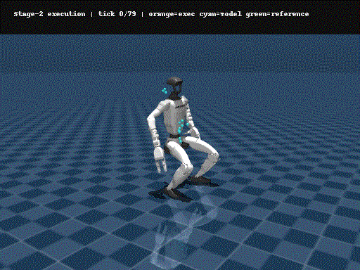
  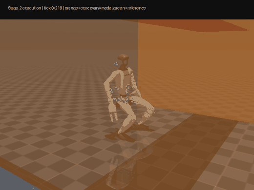
  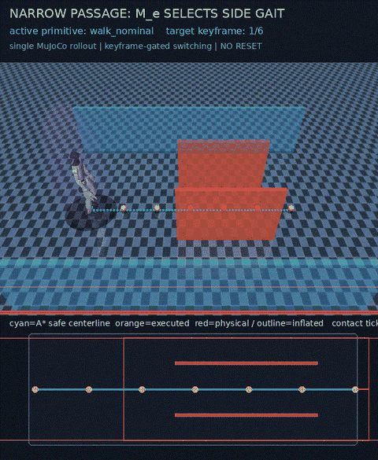
  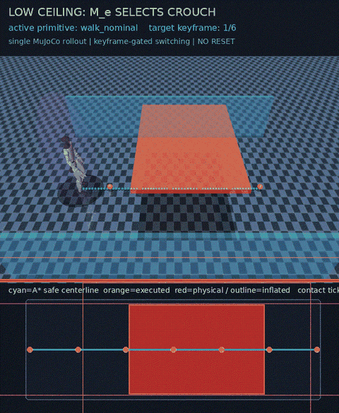
</p>

#### Extended long-sequence tasks

<p>
  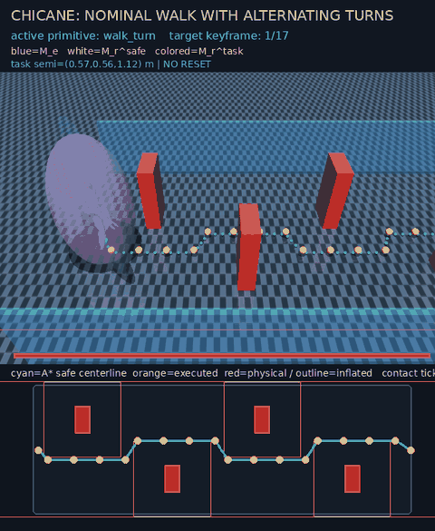
  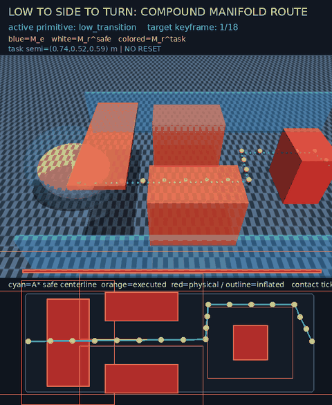
</p>
<p>
  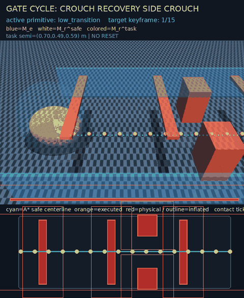
  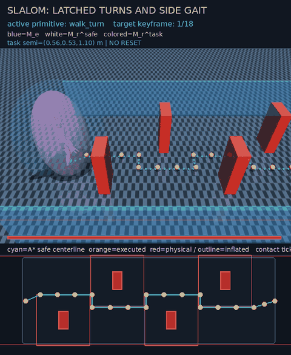
</p>

All four extended tasks pass the same continuous MuJoCo/SONIC gate with zero obstacle-contact
ticks. They reach 17, 18, 15 and 18 keyframes respectively. Chicane uses nominal walking plus
curvature turns; the slalom uses nominal walking, three bilateral side-gait intervals and
curvature turns. Low-side-turn additionally includes explicit low-clearance transition helpers.
Every primitive sequence is derived from measured aperture and route curvature, not from a
scripted segment schedule.
The machine-readable acceptance rows are in [`docs/demo_gallery/extended_acceptance.json`](docs/demo_gallery/extended_acceptance.json).

See [`DEMO_GALLERY.md`](/docs/demo_gallery/README.md) for the complete list, scenario descriptions and
reproduction command. The quantitative pilot log is [`CVPR_PILOT_RESULTS.md`](/docs/experiments/CVPR_PILOT_RESULTS.md).
The 104-row primary adapter preflight is summarized in
[`docs/experiments/results/cvpr_primary_smoke_report.json`](docs/cvpr_primary_smoke_report.json); it is explicitly
structural-only and is not paper statistics.

### Deploy perception demo

The `deploy` branch adds a reproducible perception loop: MuJoCo radar returns are fused into a
global-coordinate 3-D probabilistic voxel grid. Incremental truncated ESDF and D* Lite plan on a
ground-bound projection while the full 3-D map supplies vertical clearance and a root-local 3-D
ellipsoidal safe corridor. Run
`run_deploy_perception_demo.ps1` (or `./scripts/run_deploy_perception_demo.sh` in WSL) and inspect
the synchronized GIF linked from [`DEMO_GALLERY.md`](/docs/demo_gallery/README.md). Coordinate contracts and the real-sensor
replacement points are documented in [`DEPLOY_PERCEPTION.md`](/docs/stage2/DEPLOY_PERCEPTION.md). The deploy
layer supplies the P1 condition input; the same primitive router, Stage-2 generator, SONIC hard
gate and MuJoCo executor continue to run while new radar frames arrive.
The dynamic demos use timestamped obstacle schedules shared by the physical MuJoCo world, radar
world, probability map, renderer and exact self-manifold audit. The four-event Ours-4 pilot
(crossing, appearance/disappearance, moving wall and route reopen) reaches every keyframe with
zero obstacle contacts and no self-manifold safety stop. The live-route metrics and run IDs are
recorded in [`docs/experiments/results/cvpr_dynamic_physical_pilot.json`](docs/cvpr_dynamic_physical_pilot.json);
they are adapter evidence, not a final multi-seed paper result.

Start with [`CURRENT.md`](/docs/architecture/CURRENT.md) and [`STATUS.md`](/docs/stage2/STATUS.md) for the current runnable closed loop.
[`ARCHITECTURE.md`](/docs/architecture/ARCHITECTURE.md) and [`PIPELINE.md`](/docs/architecture/PIPELINE.md) retain the original design history and static-stage diagnosis;
they are not the authoritative statement that Stage-2 is absent. [`ROADMAP.md`](/docs/ROADMAP.md) records the
remaining generalisation work.

## Layout

| Path | Contents |
|---|---|
| `manifold_motion/core/` | Geometry, kinematics, manifold specifications, constants and path contracts |
| `manifold_motion/simulation/` | MuJoCo G1 environment, SONIC wrapper, reference playback and collection |
| `manifold_motion/dataio/` | SEED metadata, archive manifests, replay records and training windows |
| `manifold_motion/perception/` | Radar/SLAM ingress, 3-D probabilistic grid, ESDF and dynamic-scene adapters |
| `manifold_motion/planning/` | Safe corridors, incremental planning and primitive routing |
| `manifold_motion/stage1/` | Static manifold-to-pose BC/RL pipeline and viewers |
| `manifold_motion/stage2/` | Dynamic Flow candidates, projection, transitions, online execution and validation |
| `manifold_motion/evaluation/` | CVPR protocols, physical smoke tests and quantitative audits |
| `manifold_motion/visualization/` | MuJoCo/GIF renderers and GitHub gallery builders |
| `scripts/` | WSL/Powershell launchers and dependency-aware `python.sh` runtime |
| `docs/` | Architecture, Stage-2 notes, CVPR protocol, results and visual gallery |
| `gear_sonic_deploy/policy/release/` | SONIC encoder/decoder ONNX + observation config (downloaded, git-ignored) |
| `data/` | G1 MuJoCo model, meshes, selected SEED capability slices and generated scenes |
| `reports/` | Clips, demonstrations, checkpoints, verification JSON (git-ignored — **back these up separately**) |

## Setup

```bash
./scripts/python.sh -m pip install -r requirements.txt
./scripts/python.sh scripts/download_from_hf.py --stage2-only  # Stage-2 encoder/decoder/config; skip the large planner
```

The G1 model and meshes live in `data/g1_flat/`. All launchers use `scripts/python.sh`, which selects `MANIFOLD_PYTHON`, the repository `.venv`, or the existing dependency-complete WSL environment and verifies MuJoCo/Torch/ONNX Runtime before starting.

## Run

Three stages, each judged by its own metric:

```bash
# ① data
./scripts/python.sh -m manifold_motion.dataio.dataset show                # health: speed, envelope, coverage
./scripts/python.sh -m manifold_motion.evaluation.demo_spread                 # how much recorded poses vary per manifold

# ② the clone
make g1-bc-train                                   # or: ./scripts/python.sh -m manifold_motion.stage1.bc train
make g1-bc-eval                                    # 94.9% of training manifolds fit

# ③ the in-the-loop fine-tune
make g1-sonic-rl                                   # ~15 min on CPU
make g1-sonic-eval                                 # BC vs fine-tuned, on the real controller

# verification and the containment ruler
make g1-verify                                     # 6/10 inside, r(sonic) median 0.976
make g1-ruler                                      # the ellipsoid-vs-box check

# see it
./scripts/python.sh -m manifold_motion.visualization.view_data replay            # ① the recording
./scripts/python.sh -m manifold_motion.stage1.show_bc                     # ② the clone on its training manifolds
./scripts/python.sh -m manifold_motion.stage1.show_rl                     # ③ the fine-tune; keys reshape the manifold
```

Viewer keys and what each number on screen means: [`PIPELINE.md`](/docs/architecture/PIPELINE.md) §7.

## Current numbers

| stage | metric | value |
|---|---|---|
| ① data | SONIC tracking error | 0.054 rad (137 clips, 18705 windows, 10336 pose pairs) |
| ② clone | pose inside its recorded envelope | 9336/9840 = **94.9%** |
| ③ in-loop | achieved pose inside the perturbed envelope | success **1.00**, r **0.82** |
| gate | `verify_sonic` | **6/10** inside, r(sonic) median 0.976 |
| SEED capability gate | frozen SONIC/MuJoCo accepted families | **21/30** families; **187/194** selected clips |
| state-conditioned environment prior v6 | test MSE improvement over zero baseline | **49.9%** (727 actor-disjoint windows; target_exec) |
| SLAM/self-manifold composer | test Top-1 / Top-3 / macro-F1 | **57.8% / 79.0% / 58.5%** across 21 executable families |
| failure-directed supplement | accepted / selected; local adapter test MSE | **17/30**; **5.733 → 5.683** |

The current four-scene online projection regression is recorded in
`reports/manifold_motion/stage2_online_projection_v1/comparison_report.json` and is separate
from the older static `verify_sonic` gate above.

The extended SEED → prior → composer pipeline and its exact reproduction commands are documented
in [`SEED_CAPABILITY.md`](/docs/stage2/SEED_CAPABILITY.md). Generated checkpoints and replay records
remain under ignored `reports/`; the source manifests and code contracts are versioned.
The compact result snapshot is
[`seed_conditioned_pipeline_v1.json`](/docs/experiments/results/seed_conditioned_pipeline_v1.json).

## Known blocker

Tilted and very narrow manifolds (`report_specs` t=±10) sit at r 1.12–1.33. Diagnosed: the
manifolds are geometrically solvable (a body pitched 7–8° fits at r 0.97), the policy responds
in the right direction but with about half the needed amplitude, and training on tilted
manifolds makes things **worse** rather than better — the policy answers with waist pitch, which
the frozen controller does not follow. The fix is a pose channel the controller tracks
(`vr_3point_local_target`), not more training pressure. Details: [`PIPELINE.md`](/docs/architecture/PIPELINE.md) §6.
