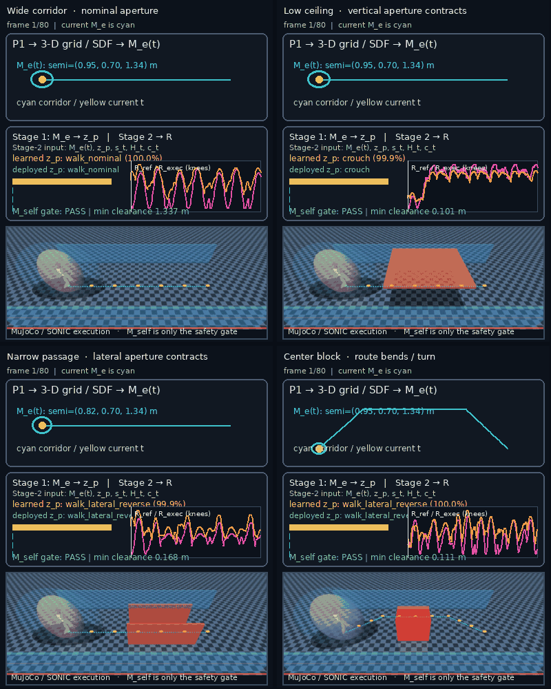
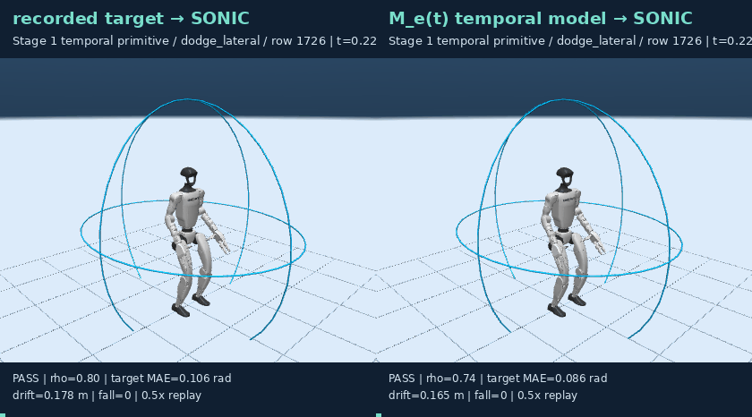
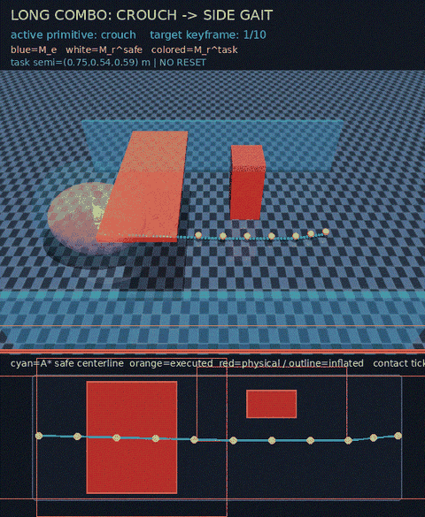
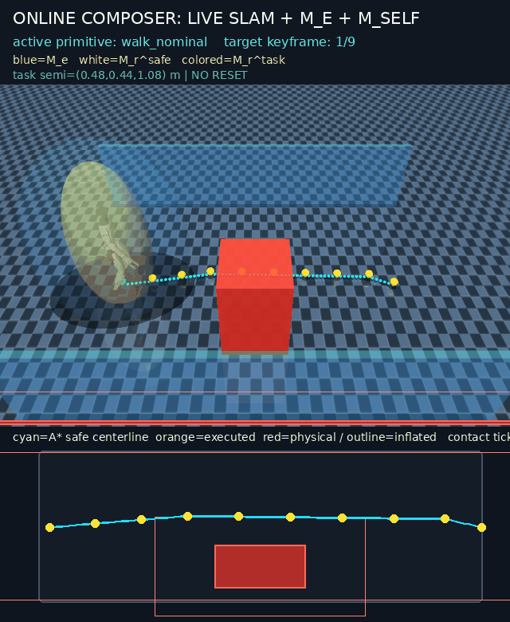
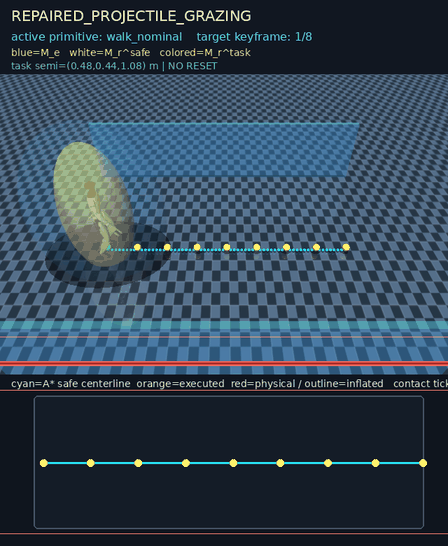

<div align="center">

# Manifold-Motion

### Environment-manifold-conditioned whole-body motion for the Unitree G1

`SEED` · `MuJoCo` · `NVIDIA GEAR-SONIC` · `3-D radar/SLAM` · `Flow Matching`

[Method](#method) · [Visual evidence](#visual-evidence) · [Experiments](#experiments) · [Reproduce](#reproduce) · [Limitations](#limitations)

</div>

---

## Method

Manifold-Motion maps a time-varying environment corridor \(M_e(t)\) and the executed robot
body envelope \(M_r(t)\) to a physically executable whole-body reference. The `deploy`
branch adds a simulated radar/SLAM front-end: range returns update a robot-centred,
world-aligned 3-D probabilistic voxel map; incremental ESDF and D* Lite/A* produce a local
safe corridor; the downstream Stage 1/Stage 2 stack selects and screens a SEED primitive
before the frozen SONIC controller drives G1 in MuJoCo.

```text
radar + pose stream
        ↓
3-D probability grid → ESDF / D* Lite → environment manifold M_e(t)
        ↓
Stage 1: p(z_p | M_e) → primitive family
        ↓
Stage 2: Flow Matching (M_e, z_p, state, history) → reference R
        ↓
optimization-embedded projection + self-manifold/contact gate
        ↓
SONIC (frozen base or bounded adapter) → MuJoCo G1
```



The videos below are representative evidence, not a replacement for the numerical gates.
Every reported result is replayed from the same scene, seed, controller and MuJoCo safety
checks; failed runs remain in the reports.

## Visual evidence

| Stage | Representative result | What it demonstrates |
|---|---|---|
| Data preparation | [paired manifold/action gallery](docs/demo_gallery/README.md) · [example pair](docs/demo_gallery/manifold_action_pairs_v1/me_action_001441_crouch_walk_pair.gif) | A synchronized \(M_e/M_r\) animation and its recorded G1 action; the full catalogue contains locomotion, crouch, lateral dodge, jump, kneel, crawl, carry and interaction-source families. |
| Stage 1 · primitive routing |  | Geometry-only \(M_e\!\to z_p\) routing with actor-disjoint SEED clips. |
| Stage 2 · static manifold |  | The same route under wide and low corridors; the selected primitive changes from nominal walk to crouch. |
| Stage 2 · long horizon |  | Segment-wise primitive transitions with continuous phase handoff and self-manifold checks. |
| Online perception |  | Live radar/map updates feeding \(M_e(t)\), routing and semantic reconditioning. |
| Dynamic obstacle |  | Replanning/waiting under a moving obstacle; the route and primitive are not hard-coded to a single static path. |
| Impact response |  | A guarded reactive scenario; use the report for the exact event and acceptance gates. |

The homepage intentionally shows only representative media. The [demo index](docs/demo_gallery/README.md)
contains the complete GIF manifest, provenance and the larger action-pair table.

## Experiments

### Current quantitative status

| Track | Protocol | Result | Status |
|---|---|---:|---|
| Perception chain | 8 simulated seeds; radar → 3-D grid → A*/ESDF → \(M_e\) | 8/8 accepted | Passed as a chain test; pose is MuJoCo ground truth, not a real-SLAM accuracy claim. |
| Frozen physical pilot | 3 seeds × 5 scenarios × 4 methods = 60 MuJoCo rows | See [pilot summary](docs/experiments/results/cvpr_multiseed_core_v1_summary.json) | Reproducible pilot; not yet an external SOTA claim. |
| SONIC adapter warm-start | 3 training seeds | mean test MSE improvement ≈ 0.87%; exact zero-init parity | Supervised warm-start, then physical gate required. |
| SONIC adapter physical A/B | wide/low/narrow × frozen/adapter | 6/6 keyframes and 0 obstacle contacts for all 6 rows | Adapter is usable and bounded; it is not uniformly better on every metric. |
| Dynamic adapter safety | online radar crossing × frozen/adapter | 8/8 keyframes and 0 obstacle contacts with adapter scale 0.25 | Full residual is rejected under this domain shift; the trust-region result is reported as a safety finding. |
| Low-clearance capability | low-1.10 m vs low-1.00 m | 3/3 vs 0/3 under frozen SONIC limits | The 1.00 m result is a controller-capability failure, not hidden as a planning success. |

The physical adapter audit is [here](docs/experiments/results/sonic_adapter_physical_ab_v1.json).
The dynamic crossing audit is [here](docs/experiments/results/sonic_adapter_dynamic_ab_v1.json).
Its contract is strict: same generated candidates and scene seeds, with only the bounded
condition adapter enabled/disabled. The adapter consumes 69-D executed state, 12-frame
history, corridor/SDF, command and the available catalogue token; it is disabled by default.

### SOTA protocol

This repository does **not** claim SOTA merely because a local pilot is successful. The
[benchmark plan](docs/experiments/SOTA_BENCHMARK_PLAN.md) defines candidate external methods,
SEED/AMASS/BABEL/Habitat/ScanNet data layers, the common G1/MuJoCo protocol, multi-seed
confidence intervals and an external-baseline readiness gate. Until a public method is
adapted and reproduced under the same robot, controller, scenes and safety gates, its row is
reported as `not_ready` rather than assigned an invented number.

The proposed manifold-conditioned safety metric, MCSA, is reported together with conventional
success, collision, clearance, tracking and latency. It captures whether the selected body
envelope remains feasible as \(M_e(t)\) contracts; it is an additional metric, not a licence
to discard standard benchmarks.

### Data preparation and Stage 1

The accepted data path is:

```text
SEED clip → frozen SONIC/MuJoCo replay → admission gate
         → measured execution M_r(t)
         → reverse corridor / synchronized manifold-action pair
         → actor-disjoint primitive router and imitation checkpoint
```

The [paired gallery](docs/demo_gallery/README.md) is the visual audit for this step. It does
not claim that a source label such as “ladder” or “door” is already a successful interaction
task; those clips are capability data until a matching environment and physical gate exist.

## Reproduce

The repository is designed to run in the existing WSL environment. The helper selects the
project Python environment and sets the MuJoCo headless renderer where needed.

```bash
cd /home/xiyuan/Manifold-Motion-Pipline
export PYTHONPATH="$PWD:/home/xiyuan/.local/share/sonic-manifold-g1"
export MUJOCO_GL=egl

# unit and contract tests
./scripts/python.sh -m pytest -q

# simulated radar / 3-D map / A* chain (8 seeds by default)
./scripts/run_simulated_slam_seeds.sh

# frozen physical CVPR pilot
./scripts/run_cvpr_multiseed_core.sh

# bounded SONIC adapter warm-start (CPU-safe, three seeds)
./scripts/run_sonic_adapter_multiseed.sh

# online dynamic crossing A/B; dynamic scenes use a 0.25 residual trust region
./scripts/run_sonic_adapter_dynamic_ab.sh

# one physical adapter A/B scene; omit --sonic-adapter for the frozen baseline
./scripts/python.sh -m manifold_motion.stage2.manifold_adaptive \\
  --scene data/g1_flat/scene_manifold_low_long.xml \\
  --title "LOW: SONIC ADAPTER" \\
  --out reports/cvpr/sonic_adapter_physical_v1/adapter_low \\
  --sonic-adapter reports/cvpr/sonic_adapter_multiseed_v1/seed_20260923/sonic_condition_adapter.pt
```

For the full visual suite, see [STAGE2.md](STAGE2.md),
[the architecture experiment](docs/experiments/ARCHITECTURE_FIGURE_EXPERIMENT.md),
and the scripts under `scripts/`. All default commands are CPU-safe; CUDA is optional for
training and never required for the MuJoCo acceptance gate.

## Repository map

```text
manifold_motion/
  perception/       radar, probability grid, ESDF and online route updates
  planning/         A*/D* Lite-compatible corridor construction
  stage1/           primitive router and imitation checkpoints
  stage2/           Flow candidates, projection, semantic rerouting, SONIC adapter
  simulation/       MuJoCo G1 environment and frozen SONIC interface
docs/experiments/   protocols, reports and benchmark claim gates
docs/demo_gallery/  complete GIF/pair manifest and visual provenance
scripts/             reproducible CPU/WSL entry points
```

## Limitations

1. The simulated perception release uses ground-truth MuJoCo pose. Real SLAM drift,
   time-synchronisation and radar extrinsic calibration are deliberately a separate P1.
2. Frozen SONIC does not directly consume root position; root progress is measured and used by
   the scheduler/projection layer. The adapter is a bounded residual, not a new whole-body
   policy, and must be re-gated after every training change.
3. The current physical pilot is not an external SOTA proof. Reproduction of public baselines
   under the identical G1/SONIC protocol and larger confidence-bounded test suites is still
   required before making that claim.

If you use this code, cite the relevant method and data sources listed in
[SOTA_BENCHMARK_PLAN.md](docs/experiments/SOTA_BENCHMARK_PLAN.md), and report both accepted
and rejected seeds.
