<div align="center">

# Manifold-Motion

**Manifold-Conditioned Whole-Body Motion for Humanoid Robots**

Unitree G1 · MuJoCo · NVIDIA GEAR-SONIC · SEED

[Overview](#overview) · [Data preparation](#data-preparation) · [Paired gallery](#paired-gallery) · [Stage 1](#stage-1-results) · [Stage 2](#stage-2-entry) · [Reproduction](#reproduction)

</div>

---

## Overview

Manifold-Motion is a research framework for relating **environment geometry, robot body shape,
and executable whole-body motion**. Environment constraints are represented by an ellipsoidal
corridor `M_e(t)`; the pose-dependent body envelope `M_self(t)` describes the robot's occupied
extent. A frozen NVIDIA GEAR-SONIC controller executes motion references on a Unitree G1 in MuJoCo.

The `deploy` branch adds the perception input to the existing motion pipeline: simulated range
returns and a pose stream update a world-aligned, robot-centred 3-D probabilistic voxel map.
Incremental ESDF and D* Lite support ground-bound routing, while 3-D clearance supplies the
ellipsoidal corridor. The downstream geometry/safety router, screened SEED primitives, projection,
and SONIC/MuJoCo execution remain in place. The simulated pose stream currently uses MuJoCo
ground truth; it is **not** an independently validated SLAM estimator.

**This page focuses on Step 1: paired manifold–action data preparation.** Earlier navigation,
controller, and long-horizon previews are no longer embedded on the homepage. Their artifacts
remain available in the [historical demo index](docs/demo_gallery/README.md).
The learned latent prior/composer is an archived ablation, not the default motion pipeline.

## Data preparation

The current data-construction direction is **recorded action → measured body envelope →
reverse-synthesized environment manifold**. It supplies paired supervision for subsequent
manifold-to-action learning; it is not itself a demonstration of learned inference.

```text
SEED G1 motion
    → frozen SONIC / MuJoCo replay and admission
    → recorded execution R_exec(t) and measured M_self(t)
    → reverse-synthesized corridor M_e(t)
    → paired windows with state, history, and reference / executed targets
```

**Dataset snapshot.** 3,988 overlapping windows · 118 actors · 21 source action families.
Actor-disjoint splits contain 2,610 training, 651 validation, and 727 test windows.
These counts describe the current corpus, not 3,988 independent skills or a benchmark success rate.

**Visual audit protocol.** The gallery below contains one window per source family, selected
deterministically by the largest mean joint-frame change. Each pair comes from the same clip
and time interval, and its 29 joint angles, root position, and root rotation are checked against
the recorded target before rendering. This is an illustrative selection, not random evaluation.

- **Left — manifold GIF:** cyan `M_e(t)` is the reverse-synthesized corridor; orange `M_self(t)`
  is the pose-dependent body envelope.
- **Centre — description:** the source category, inspection focus, catalogue ID, actor, split,
  and a synchronized comparison link.
- **Right — action GIF:** a kinematic replay of the corresponding recorded SONIC/MuJoCo execution,
  not a newly generated action or a new physics trial.

Every window contains **36 frames at 30 Hz (1.2 s)**, displayed at **0.5× speed (2.4 s per loop)**.
Cameras are fixed within a window and fitted independently for each column; both floor grids use
0.5 m spacing. Independent GIFs can start at different times in a browser: use each row's
**synchronized pair** link for strict frame-by-frame comparison.

> **Interpretation boundary.** These environment manifolds are synthesized from motion, not
> estimated from obstacles or sensor data. Source labels such as ladder, box jump, and door
> interaction do not establish successful interaction with those objects. These pairs are
> data-preparation evidence, not autonomous obstacle avoidance, trained-model performance,
> or SOTA results.

## Paired gallery

**Table 1. Manifold–action pairs grouped by source motion category.** The two animated columns
visualize the same source window. Descriptions state what to inspect without treating the source
label as a completed task.

<table>
  <thead>
    <tr>
      <th align="center" width="35%">流形 GIF<br /><sub>Environment & self manifold</sub></th>
      <th align="center" width="30%">说明<br /><sub>Sample description & provenance</sub></th>
      <th align="center" width="35%">动作 GIF<br /><sub>Recorded G1 execution</sub></th>
    </tr>
  </thead>
  <tbody>
    <tr><th colspan="3" align="left">A · Locomotion &amp; heading / 位移与朝向</th></tr>
    <tr>
      <td align="center" valign="middle">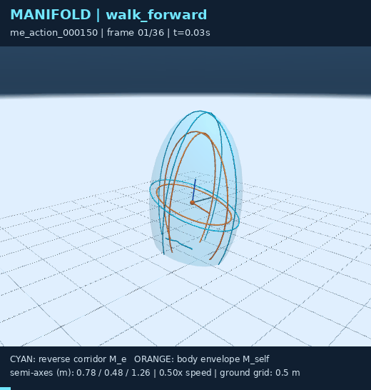</td>
      <td align="left" valign="middle"><strong>01 · Forward walking · 直行</strong><br /><br />观察步态周期内的自身包络，以及配对流形的平移和尺度变化。<br /><br /><code>me_action_000150</code><br /><sub>train · actor A518 · 36 frames</sub><br /><a href="docs/demo_gallery/manifold_action_pairs_v1/me_action_000150_walk_forward_pair.gif">同步对照 / synchronized pair ↗</a></td>
      <td align="center" valign="middle">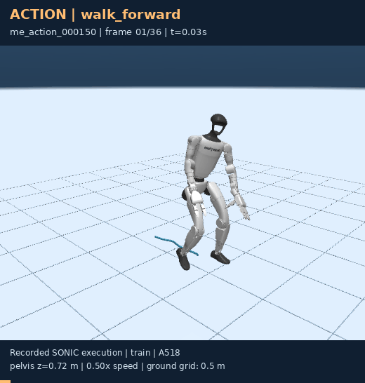</td>
    </tr>
    <tr>
      <td align="center" valign="middle">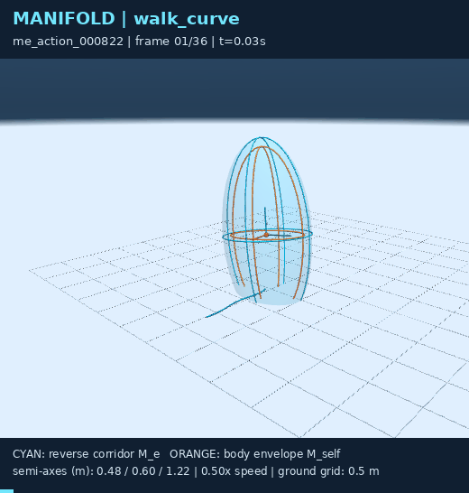</td>
      <td align="left" valign="middle"><strong>02 · Curved walking · 曲线行走</strong><br /><br />观察转弯过程中的根轨迹、包络朝向与半轴变化。<br /><br /><code>me_action_000822</code><br /><sub>test · actor A182 · 36 frames</sub><br /><a href="docs/demo_gallery/manifold_action_pairs_v1/me_action_000822_walk_curve_pair.gif">同步对照 / synchronized pair ↗</a></td>
      <td align="center" valign="middle">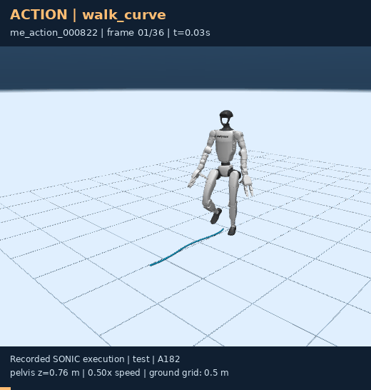</td>
    </tr>
    <tr>
      <td align="center" valign="middle">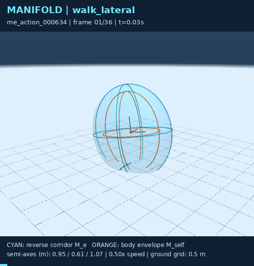</td>
      <td align="left" valign="middle"><strong>03 · Lateral walking · 侧向行走</strong><br /><br />观察横向步态与身体包络的方向变化；本片段不含窄通道。<br /><br /><code>me_action_000634</code><br /><sub>test · actor A362 · 36 frames</sub><br /><a href="docs/demo_gallery/manifold_action_pairs_v1/me_action_000634_walk_lateral_pair.gif">同步对照 / synchronized pair ↗</a></td>
      <td align="center" valign="middle">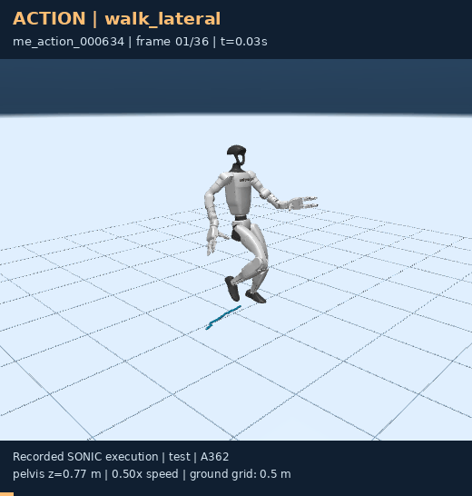</td>
    </tr>
    <tr>
      <td align="center" valign="middle">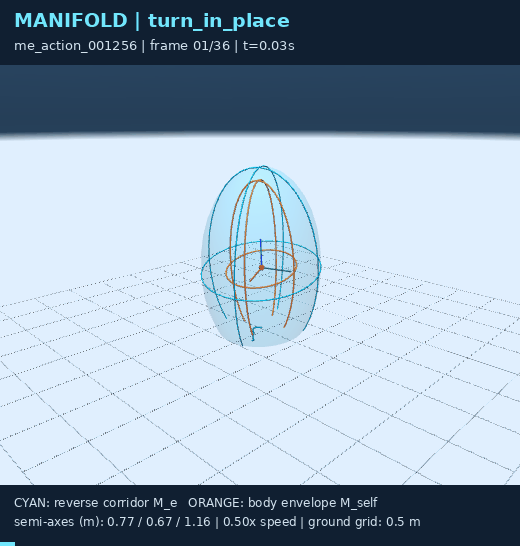</td>
      <td align="left" valign="middle"><strong>04 · Turning · 原地转向</strong><br /><br />观察转向窗口中，身体朝向与流形姿态的时间对应。<br /><br /><code>me_action_001256</code><br /><sub>validation · actor A123 · 36 frames</sub><br /><a href="docs/demo_gallery/manifold_action_pairs_v1/me_action_001256_turn_in_place_pair.gif">同步对照 / synchronized pair ↗</a></td>
      <td align="center" valign="middle">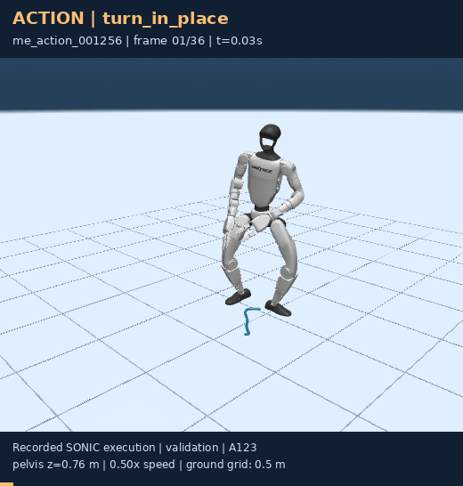</td>
    </tr>
    <tr>
      <td align="center" valign="middle">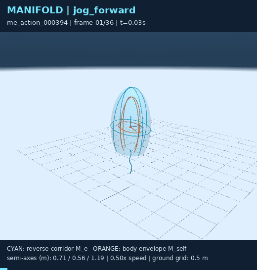</td>
      <td align="left" valign="middle"><strong>05 · Jogging · 慢跑</strong><br /><br />观察较快步态中的姿态周期与自身包络变化。<br /><br /><code>me_action_000394</code><br /><sub>train · actor A094 · 36 frames</sub><br /><a href="docs/demo_gallery/manifold_action_pairs_v1/me_action_000394_jog_forward_pair.gif">同步对照 / synchronized pair ↗</a></td>
      <td align="center" valign="middle">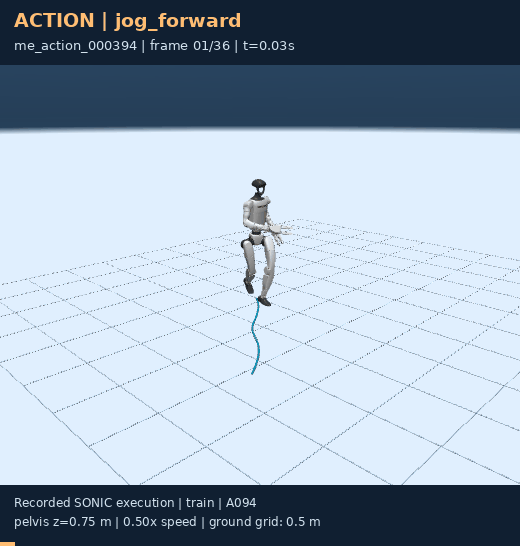</td>
    </tr>
    <tr>
      <td align="center" valign="middle">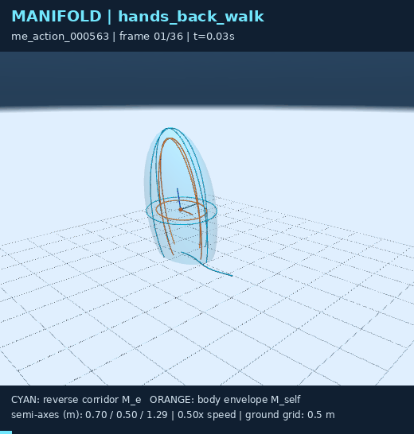</td>
      <td align="left" valign="middle"><strong>06 · Hands-back walking · 背手行走</strong><br /><br />观察手臂构型改变后，行走姿态与包络尺度的对应关系。<br /><br /><code>me_action_000563</code><br /><sub>train · actor A238 · 36 frames</sub><br /><a href="docs/demo_gallery/manifold_action_pairs_v1/me_action_000563_hands_back_walk_pair.gif">同步对照 / synchronized pair ↗</a></td>
      <td align="center" valign="middle">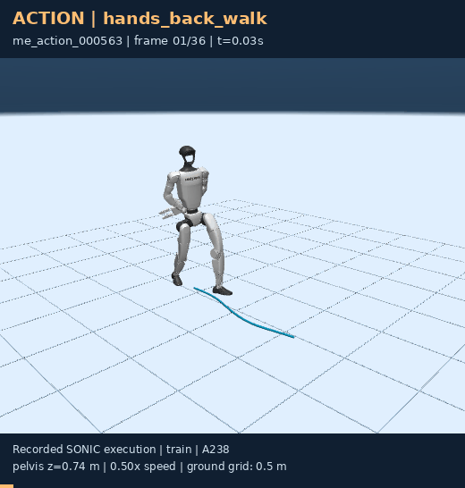</td>
    </tr>
    <tr><th colspan="3" align="left">B · Posture &amp; support / 姿态与支撑</th></tr>
    <tr>
      <td align="center" valign="middle">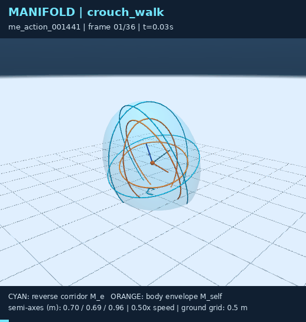</td>
      <td align="left" valign="middle"><strong>07 · Crouched walking · 蹲走</strong><br /><br />观察低姿态步态中，竖直半轴与骨盆高度的变化。<br /><br /><code>me_action_001441</code><br /><sub>validation · actor A129 · 36 frames</sub><br /><a href="docs/demo_gallery/manifold_action_pairs_v1/me_action_001441_crouch_walk_pair.gif">同步对照 / synchronized pair ↗</a></td>
      <td align="center" valign="middle">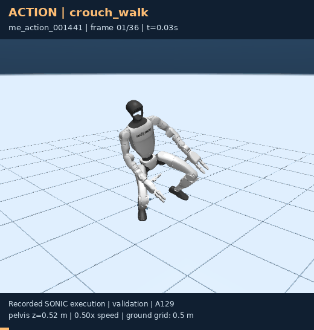</td>
    </tr>
    <tr>
      <td align="center" valign="middle">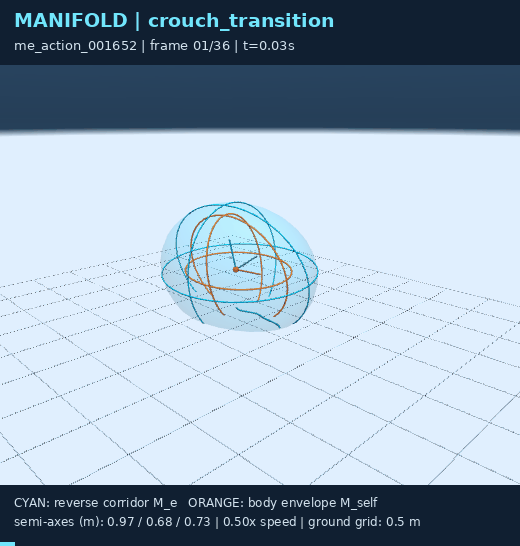</td>
      <td align="left" valign="middle"><strong>08 · Crouch transition · 蹲姿转换</strong><br /><br />观察转换窗口内，躯干、腿部构型与椭球形状的变化。<br /><br /><code>me_action_001652</code><br /><sub>validation · actor A129 · 36 frames</sub><br /><a href="docs/demo_gallery/manifold_action_pairs_v1/me_action_001652_crouch_transition_pair.gif">同步对照 / synchronized pair ↗</a></td>
      <td align="center" valign="middle">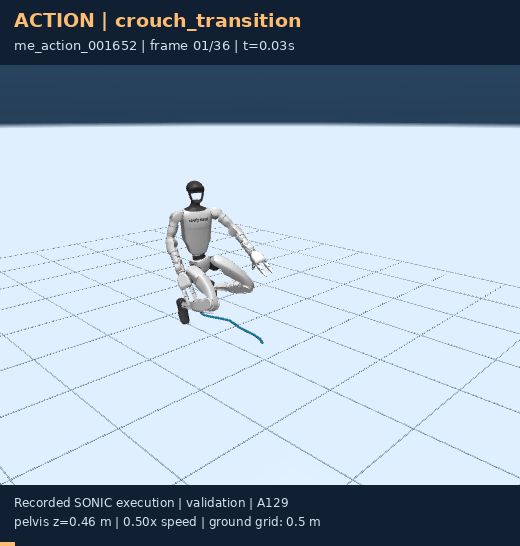</td>
    </tr>
    <tr>
      <td align="center" valign="middle">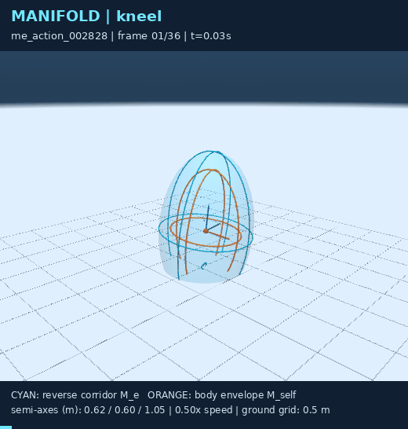</td>
      <td align="left" valign="middle"><strong>09 · Kneeling-source motion · 跪姿片段</strong><br /><br />观察跪姿来源窗口中的下肢构型与包络尺度。<br /><br /><code>me_action_002828</code><br /><sub>validation · actor A184 · 36 frames</sub><br /><a href="docs/demo_gallery/manifold_action_pairs_v1/me_action_002828_kneel_pair.gif">同步对照 / synchronized pair ↗</a></td>
      <td align="center" valign="middle">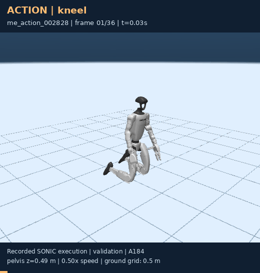</td>
    </tr>
    <tr>
      <td align="center" valign="middle">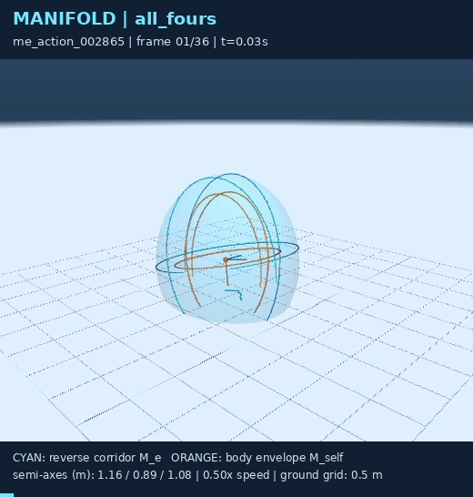</td>
      <td align="left" valign="middle"><strong>10 · All-fours-source motion · 四肢支撑片段</strong><br /><br />观察四肢支撑来源窗口中的躯干方向与包络变化。<br /><br /><code>me_action_002865</code><br /><sub>test · actor A201 · 36 frames</sub><br /><a href="docs/demo_gallery/manifold_action_pairs_v1/me_action_002865_all_fours_pair.gif">同步对照 / synchronized pair ↗</a></td>
      <td align="center" valign="middle">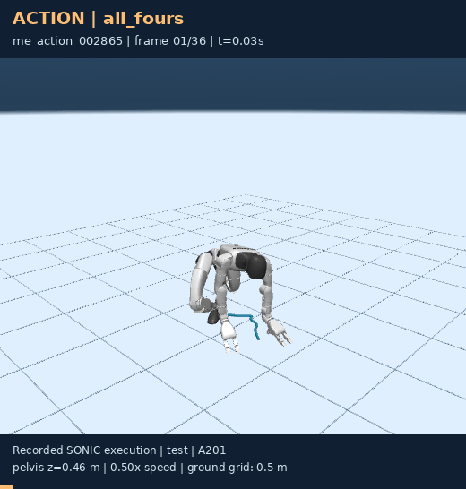</td>
    </tr>
    <tr>
      <td align="center" valign="middle">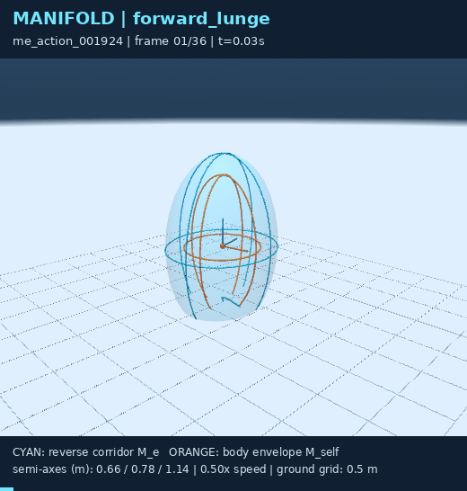</td>
      <td align="left" valign="middle"><strong>11 · Forward lunge · 前向弓步</strong><br /><br />观察前后腿展开与纵向包络尺度的对应关系。<br /><br /><code>me_action_001924</code><br /><sub>train · actor A360 · 36 frames</sub><br /><a href="docs/demo_gallery/manifold_action_pairs_v1/me_action_001924_forward_lunge_pair.gif">同步对照 / synchronized pair ↗</a></td>
      <td align="center" valign="middle">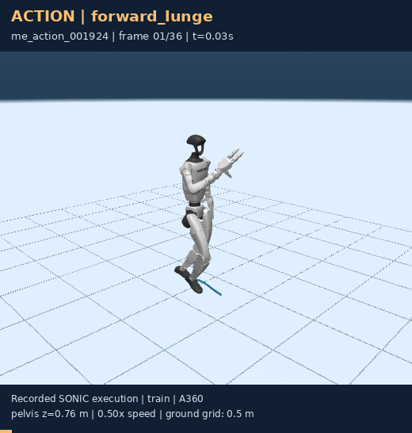</td>
    </tr>
    <tr><th colspan="3" align="left">C · Transient motions / 短时动态动作</th></tr>
    <tr>
      <td align="center" valign="middle">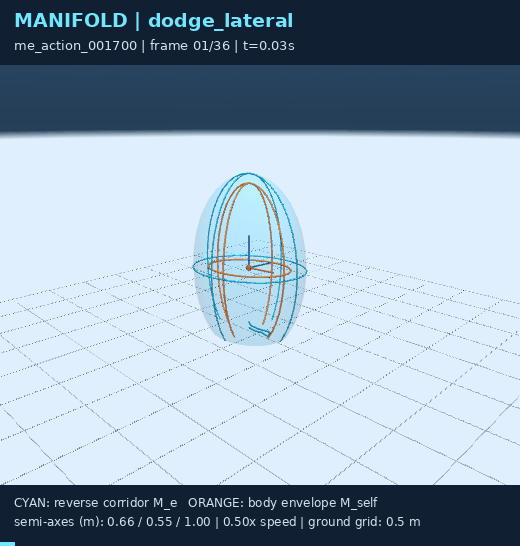</td>
      <td align="left" valign="middle"><strong>12 · Lateral dodge · 侧向闪避</strong><br /><br />观察闪避来源片段的侧向姿态变化；本片段不含来袭物体。<br /><br /><code>me_action_001700</code><br /><sub>train · actor A431 · 36 frames</sub><br /><a href="docs/demo_gallery/manifold_action_pairs_v1/me_action_001700_dodge_lateral_pair.gif">同步对照 / synchronized pair ↗</a></td>
      <td align="center" valign="middle">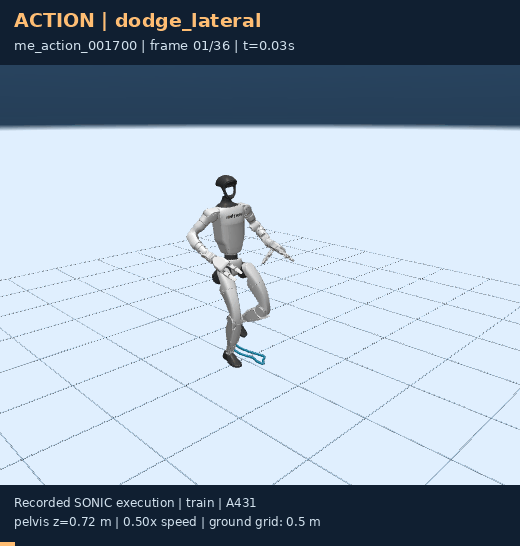</td>
    </tr>
    <tr>
      <td align="center" valign="middle">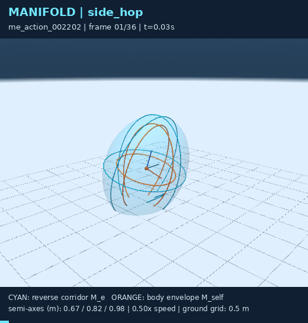</td>
      <td align="left" valign="middle"><strong>13 · Side hop · 侧向跳步</strong><br /><br />观察侧向跳步来源窗口的根高度与肢体包络变化。<br /><br /><code>me_action_002202</code><br /><sub>train · actor A361 · 36 frames</sub><br /><a href="docs/demo_gallery/manifold_action_pairs_v1/me_action_002202_side_hop_pair.gif">同步对照 / synchronized pair ↗</a></td>
      <td align="center" valign="middle">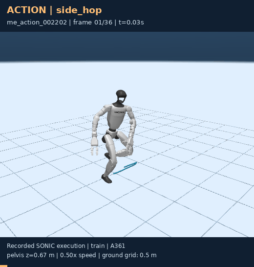</td>
    </tr>
    <tr>
      <td align="center" valign="middle">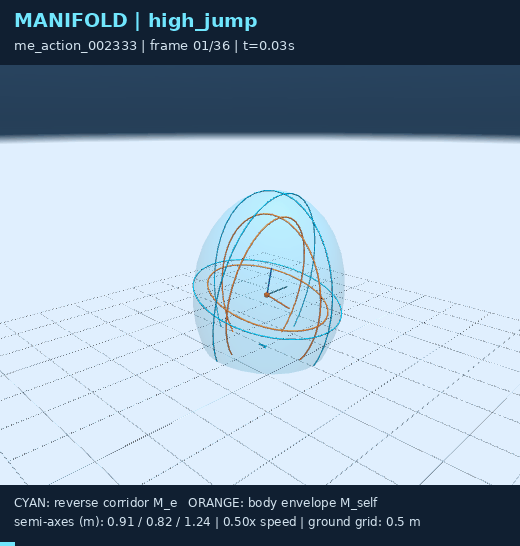</td>
      <td align="left" valign="middle"><strong>14 · High-jump-source motion · 高跳片段</strong><br /><br />观察高跳来源窗口的根高度、肢体收展与流形变化。<br /><br /><code>me_action_002333</code><br /><sub>validation · actor A349 · 36 frames</sub><br /><a href="docs/demo_gallery/manifold_action_pairs_v1/me_action_002333_high_jump_pair.gif">同步对照 / synchronized pair ↗</a></td>
      <td align="center" valign="middle">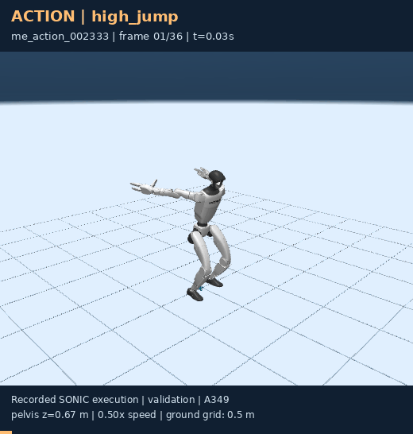</td>
    </tr>
    <tr><th colspan="3" align="left">D · Interaction-source motions / 交互来源片段</th></tr>
    <tr>
      <td align="center" valign="middle">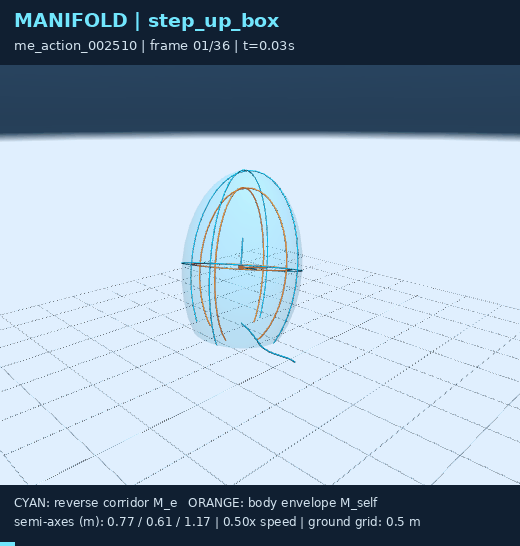</td>
      <td align="left" valign="middle"><strong>15 · Step-up source · 上台阶片段</strong><br /><br />来自上台阶类动作；观察抬腿与包络变化。无实际台阶交互。<br /><br /><code>me_action_002510</code><br /><sub>validation · actor A123 · 36 frames</sub><br /><a href="docs/demo_gallery/manifold_action_pairs_v1/me_action_002510_step_up_box_pair.gif">同步对照 / synchronized pair ↗</a></td>
      <td align="center" valign="middle">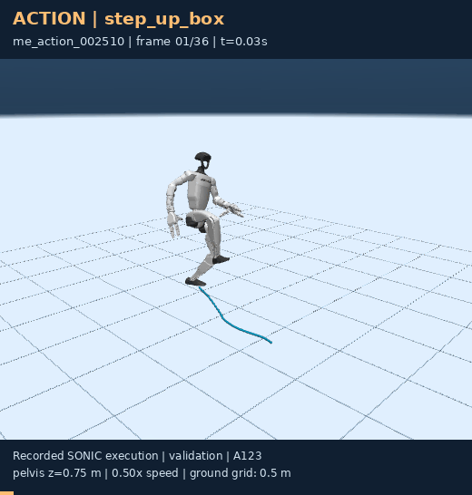</td>
    </tr>
    <tr>
      <td align="center" valign="middle">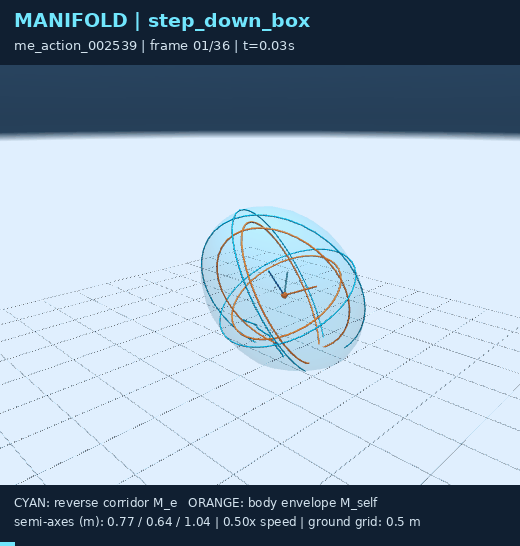</td>
      <td align="left" valign="middle"><strong>16 · Step-down source · 下台阶片段</strong><br /><br />来自下台阶类动作；观察下肢伸展与包络变化。无实际台阶交互。<br /><br /><code>me_action_002539</code><br /><sub>test · actor A251 · 36 frames</sub><br /><a href="docs/demo_gallery/manifold_action_pairs_v1/me_action_002539_step_down_box_pair.gif">同步对照 / synchronized pair ↗</a></td>
      <td align="center" valign="middle">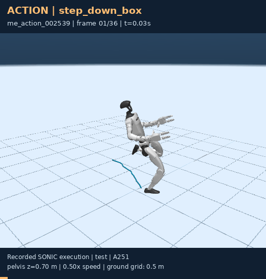</td>
    </tr>
    <tr>
      <td align="center" valign="middle">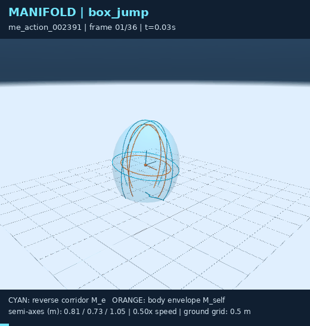</td>
      <td align="left" valign="middle"><strong>17 · Box-jump source · 箱跳片段</strong><br /><br />来自箱跳类动作；展示配对执行窗口，不代表已完成跳箱。<br /><br /><code>me_action_002391</code><br /><sub>train · actor A361 · 36 frames</sub><br /><a href="docs/demo_gallery/manifold_action_pairs_v1/me_action_002391_box_jump_pair.gif">同步对照 / synchronized pair ↗</a></td>
      <td align="center" valign="middle">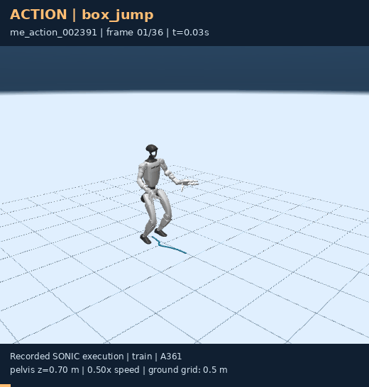</td>
    </tr>
    <tr>
      <td align="center" valign="middle">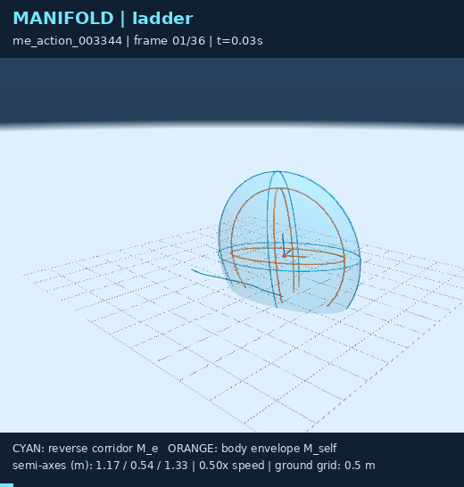</td>
      <td align="left" valign="middle"><strong>18 · Ladder source · 攀梯片段</strong><br /><br />来自攀梯类动作；观察四肢协调构型。未放置梯子。<br /><br /><code>me_action_003344</code><br /><sub>train · actor A301 · 36 frames</sub><br /><a href="docs/demo_gallery/manifold_action_pairs_v1/me_action_003344_ladder_pair.gif">同步对照 / synchronized pair ↗</a></td>
      <td align="center" valign="middle">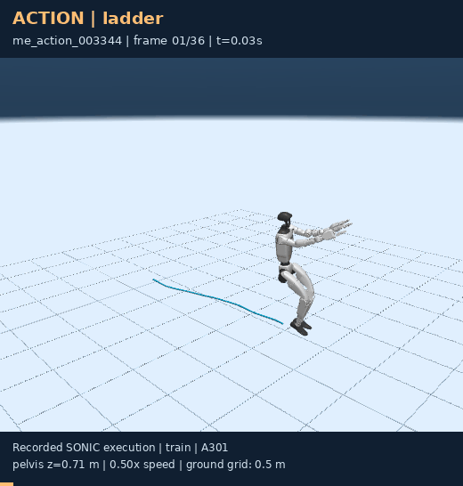</td>
    </tr>
    <tr>
      <td align="center" valign="middle">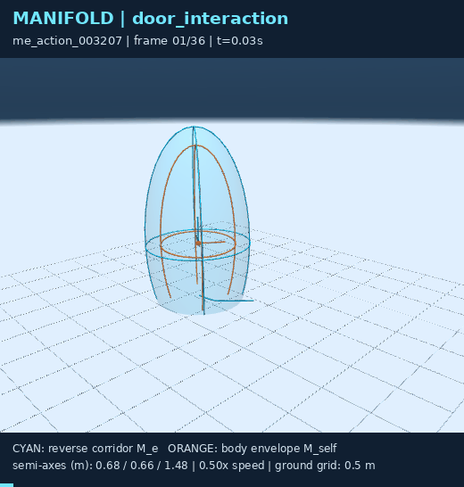</td>
      <td align="left" valign="middle"><strong>19 · Door-interaction source · 开门片段</strong><br /><br />来自开门类动作；观察伸臂与躯干包络。未放置门。<br /><br /><code>me_action_003207</code><br /><sub>train · actor A513 · 36 frames</sub><br /><a href="docs/demo_gallery/manifold_action_pairs_v1/me_action_003207_door_interaction_pair.gif">同步对照 / synchronized pair ↗</a></td>
      <td align="center" valign="middle">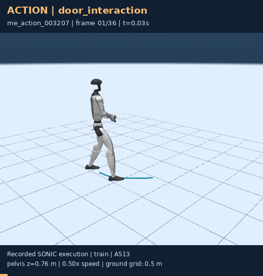</td>
    </tr>
    <tr>
      <td align="center" valign="middle">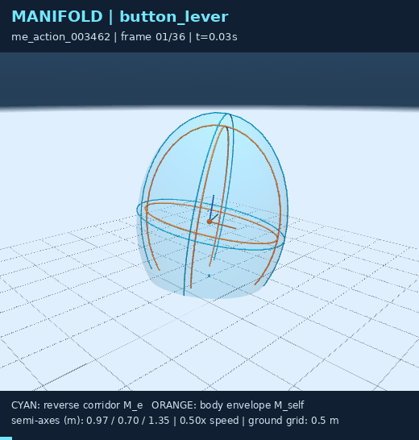</td>
      <td align="left" valign="middle"><strong>20 · Button / lever source · 按压拨杆片段</strong><br /><br />来自按钮或拨杆动作；观察上肢构型与包络。未放置操作物。<br /><br /><code>me_action_003462</code><br /><sub>train · actor A481 · 36 frames</sub><br /><a href="docs/demo_gallery/manifold_action_pairs_v1/me_action_003462_button_lever_pair.gif">同步对照 / synchronized pair ↗</a></td>
      <td align="center" valign="middle">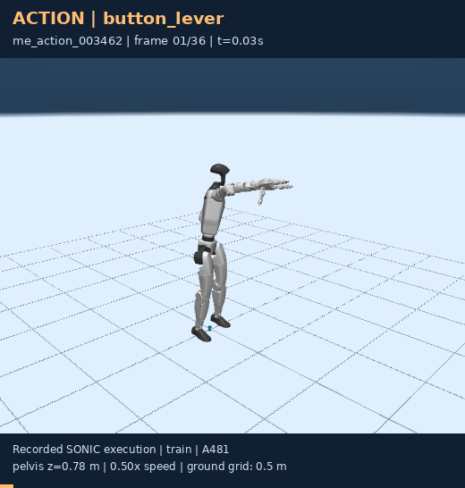</td>
    </tr>
    <tr>
      <td align="center" valign="middle">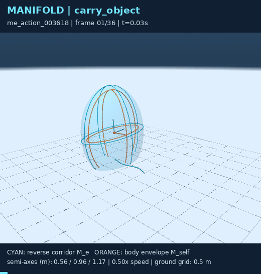</td>
      <td align="left" valign="middle"><strong>21 · Carrying source · 搬运片段</strong><br /><br />来自搬运类动作；观察手臂持物姿态与包络。未加入物体或负载。<br /><br /><code>me_action_003618</code><br /><sub>test · actor A321 · 36 frames</sub><br /><a href="docs/demo_gallery/manifold_action_pairs_v1/me_action_003618_carry_object_pair.gif">同步对照 / synchronized pair ↗</a></td>
      <td align="center" valign="middle">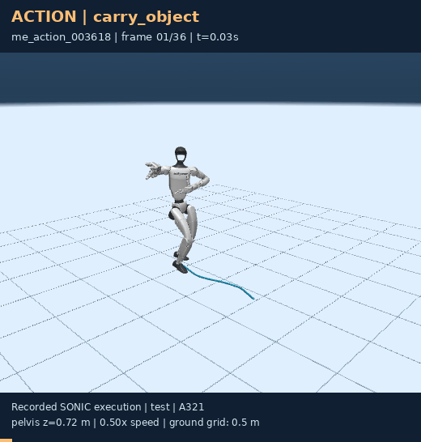</td>
    </tr>
  </tbody>
</table>

The [standalone gallery](docs/demo_gallery/manifold_action_pairs_v1/README.md) retains all individual
GIFs and synchronized composites. For local browsing with Chinese search labels, open
`docs/demo_gallery/manifold_action_pairs_v1/index.html`; GitHub displays HTML files as source rather
than hosting that interactive page. Exact clip IDs and frame origins are recorded in the
[gallery manifest](docs/demo_gallery/manifold_action_pairs_v1/manifest.json).

## Stage 1 results

Stage 1 first learns a static `M_e → pose` imitation model and evaluates it with the frozen
SONIC/MuJoCo executor.  The completed temporal extension removes the recorded primitive label
from its input: a two-layer GRU reads only the 36-frame `M_e(t)` ellipsoid sequence and predicts
both a 36-frame, 29-joint primitive and an auxiliary action-family distribution.

The confirmation set is fixed by actor identity before training. Three independent seeds use
1,587 training, 1,151 validation and 523 confirmation windows each.

| Confirmation metric | Result |
|---|---:|
| Joint trajectory MAE ↓ | **0.1936 ± 0.0031 rad** |
| Global temporal-mean baseline ↓ | 0.2227 rad |
| Velocity MAE ↓ | **0.0254 ± 0.0009 rad** |
| Action-family top-1 ↑ | **39.8 ± 5.8%** |
| SONIC/MuJoCo physical gate ↑ | **88.1 ± 2.4%** (42 fixed windows/seed) |

Each animation below is a fresh physical rollout. Left is the recorded target sent through
SONIC; right is the `M_e(t)` temporal model output sent through the same frozen controller.
Failures remain in the denominator and the extended physical set was not selected for GIF quality.

| Lateral response | Curved locomotion | Forward lunge |
|---|---|---|
| [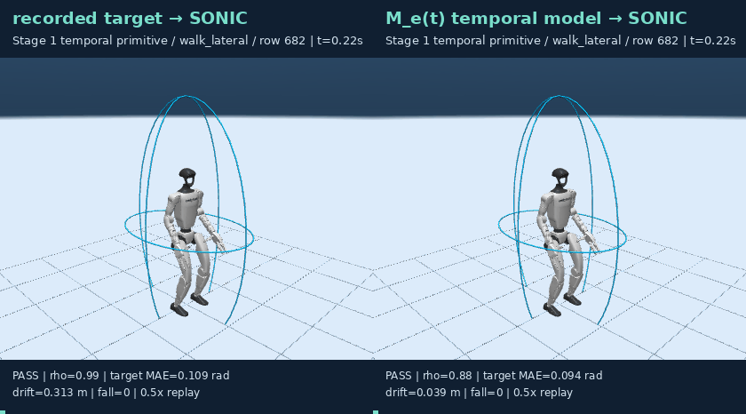](docs/experiments/stage1_temporal_primitive_v11/media/temporal_000682_walk_lateral.gif) | [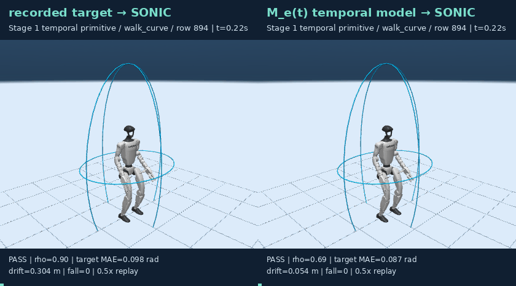](docs/experiments/stage1_temporal_primitive_v11/media/temporal_000894_walk_curve.gif) | [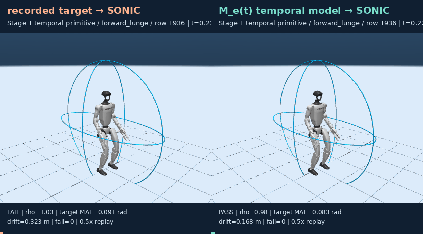](docs/experiments/stage1_temporal_primitive_v11/media/temporal_001936_forward_lunge.gif) |

Full protocols, all six GIFs and the failure manifest are in the
[Stage-1 temporal report](docs/experiments/stage1_temporal_primitive_v11/README.md),
[multi-seed audit](docs/experiments/stage1_temporal_primitive_v11/multi_seed.md), and
[failure clusters](docs/experiments/stage1_failure_clusters_v1/README.md).

## Stage 2 entry

The Stage-2 bridge now runs without an oracle primitive label. Stage 1 predicts a 30-way
probability vector from `M_e(t)`; Stage 2 combines that distribution with measured state, history,
`M_self(t)`, SDF/corridor and command. The deterministic baseline reaches `0.1379 rad` test
joint MAE and `0.0303 m` root-position MAE. The first router-conditioned latent Flow experiment
generates 16 candidates and selects them with the frozen SONIC/MuJoCo hard gate: `1/16` raw Flow
candidate passes, and `15/16` pass after the bounded optimization-embedded projection. See the
[router bridge report](docs/stage2/STAGE2_ROUTER_BRIDGE.md) and the
[router-conditioned Flow report](docs/stage2/STAGE2_ROUTER_FLOW.md).

<p align="center">
  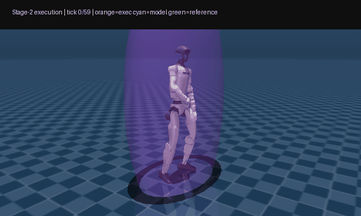
</p>

## Reproduction

### 1. Runtime and controller assets

Run commands from the repository root in WSL. Use the existing environment or create a local
virtual environment before installing dependencies.

```bash
# For a fresh checkout only; keep an existing dependency-complete environment if available.
python3 -m venv .venv
.venv/bin/python -m pip install -r requirements.txt

# Download the Stage-2 SONIC encoder, decoder, and observation configuration.
./scripts/python.sh scripts/download_from_hf.py --stage2-only
```

`scripts/python.sh` selects `MANIFOLD_PYTHON`, a repository `.venv`, or the configured local
fallback environment, checking MuJoCo, Torch, and ONNX Runtime before launching.
The G1 model and meshes are under `data/g1_flat/`. Controller weights and replay archives are
not supplied by the GIF gallery.

### 2. Prepare the source records

Rendering requires the following locally generated artifacts:

```text
reports/manifold_motion/
├── seed_capability_supported_v1/records/*.npz
└── seed_capability_windows_corridor_v1/
    ├── seed_stage2_windows.npz
    └── seed_stage2_windows_metadata.json
```

Obtain SEED under its access terms, then follow the
[capability screening and window-construction instructions](docs/stage2/SEED_CAPABILITY.md).
The [catalogue protocol](docs/experiments/MANIFOLD_ACTION_CATALOG.md) documents actor splits,
reverse-corridor construction, and data provenance. A fresh code checkout alone does not
reconstruct restricted source data.

### 3. Render the paired GIFs

```bash
# One representative window per source family; offscreen rendering, no MuJoCo GUI.
MUJOCO_GL=egl OMP_NUM_THREADS=2 OPENBLAS_NUM_THREADS=2 \
  ./scripts/python.sh -m manifold_motion.visualization.manifold_action_pairs \
  --out docs/demo_gallery/manifold_action_pairs_v1

# Inspect specific catalogue rows in a separate output directory.
MUJOCO_GL=egl OMP_NUM_THREADS=2 OPENBLAS_NUM_THREADS=2 \
  ./scripts/python.sh -m manifold_motion.visualization.manifold_action_pairs \
  --rows 150 634 1652 --out reports/manifold_motion/selected_data_pairs

# Check source pairing, absolute joint order, and GIF timing contracts.
./scripts/python.sh -m pytest -q \
  tests/test_manifold_action_pairs.py tests/test_manifold_action_catalog.py
```

For each sample, the renderer writes `*_manifold.gif`, `*_action.gif`, `*_pair.gif`, and a
`*_keyframes.jpg` proof sheet, together with an HTML gallery and a provenance manifest.
Only replay visualization runs here; this command does not train or fine-tune SONIC.

## Experimental scope

The first **three-seed Stage-1 A/B study** is available in the
[experiment report and learned-execution GIFs](docs/experiments/stage1_ab_response_v3/README.md) ([offline HTML viewer](docs/experiments/stage1_ab_response_v3/index.html)).
It evaluates all 727 held-out windows per method under an identical short-response protocol,
with a separate 3-second hold diagnostic. Manifold-conditioned imitation improves pose matching
over the no-pretraining and no-geometry controls; this PPO budget did **not** improve on imitation
under validation selection. The report retains that negative result and separates short-time
pose success from long-time stability. The data-pair gallery above remains a Step-1 data artifact.

The [bounded-residual RL follow-up](docs/experiments/stage1_residual_rl_v4/README.md)
uses repeated-context advantages, multi-epoch PPO and an executed-target reward while
keeping the imitation model and SONIC frozen. On the same development benchmark,
mean target error changes from 0.2184 to 0.2139 rad, but gate acceptance changes from
96.70% to 96.38%. This is a fidelity/safety trade-off, not a claim of across-the-board
improvement or a replacement of the default deployed controller. The report includes
all-family regressions, checkpoint provenance and new paired executions.
The 3-second hold diagnostic also regresses in gate acceptance (100.0% to 93.0%
on 57 seed-window pairs per method), so this revision remains a research candidate.

The current [mixed-horizon six-method matrix](docs/experiments/stage1_mixed_v5/README.md)
is the completed Stage-1 experiment package. It evaluates three actor-disjoint seeds,
727 short-response windows per method, and a fixed 38-window long-horizon stratified
subset. The matrix includes IL-only, mixed-horizon RL, no-IL, no-manifold, no-long-reward,
and matched-update continued-IL controls. In this frozen-SONIC/static-pose setting the
full RL result is statistically indistinguishable from IL-only (short target MAE
0.2184 vs 0.2184 rad; long target MAE 0.1904 vs 0.1904 rad), while removing IL or
manifold conditioning is clearly worse. This is an honest negative result: the current
residual PPO budget does not yet justify claiming an RL gain. The report contains the
locked protocol, checkpoint hashes, paired bootstrap intervals, six A/B GIFs, and an
[offline HTML viewer](docs/experiments/stage1_mixed_v5/index.html).

The follow-up [SONIC inverse-tracking adapter](docs/experiments/stage1_simulator_adapter_v9/README.md)
uses actual MuJoCo/SONIC hold errors rather than the recorded target as its residual label.
With legs frozen and only bounded waist/arm corrections, the three-seed development-test
mean changes from 0.2184 to 0.2169 rad at short horizon and from 0.1904 to 0.1894 rad at
the fixed long-horizon subset. Long-horizon safety is unchanged; short-horizon safety changes
by about 0.14 percentage points, so this is a measured fidelity/safety trade-off rather than
an unconditional improvement. Seed 20260929 correctly selects zero correction under the
validation gate. The report includes synchronized MuJoCo GIFs, per-seed scales, and checkpoint
provenance.

The static Stage-1 gate is now complemented by a frozen-actor confirmation protocol and a
time-aligned primitive head.  The [temporal primitive report](docs/experiments/stage1_temporal_primitive_v11/README.md)
trains only on `M_e(t)` (36 frames × 7 ellipsoid values), predicts a full 36-frame joint
sequence, and replays it through SONIC/MuJoCo.  On the held-out actor confirmation set it
reaches 0.1936 ± 0.0031 rad joint MAE across three seeds versus 0.2227 rad for a global
temporal-mean baseline. A fixed 42-window-per-seed physical confirmation reaches
88.1 ± 2.4% geometric/root-drift gate acceptance. The [failure-cluster
manifest](docs/experiments/stage1_failure_clusters_v1/failure_clusters.json) fixes the next SEED
supplement before any confirmation result is used for retraining.  This is still an upper-layer
primitive model: SONIC ONNX weights remain frozen and root motion is left to Stage 2.

The data-processing gallery is kept separate from the following experiments:

| Component | Role | Evidence and next gate |
|---|---|---|
| **Data preparation** | Recorded execution → `M_self(t)` → paired `M_e(t)` / motion windows | The 21-pair qualitative audit above; corpus and split checks in the [catalogue protocol](docs/experiments/MANIFOLD_ACTION_CATALOG.md). |
| **Stage 1** | Learn a static manifold descriptor → primitive / pose target | [Imitation and SONIC-in-the-loop experiment](docs/experiments/STAGE1_MANIFOLD_EXPERIMENT.md); [temporal confirmation](docs/experiments/stage1_temporal_primitive_v11/README.md); [SONIC residual adapter](docs/experiments/stage1_sonic_adapter_v2/README.md). |
| **Stage 2** | Add time-varying geometry, measured state, and history | [Router bridge and first dynamic baseline](docs/stage2/STAGE2_ROUTER_BRIDGE.md) · [Stage-2 implementation](docs/stage2/STAGE2.md) · [geometry-routed mainline](docs/stage2/GEOMETRY_ROUTED_MAINLINE.md); generated candidates must pass controller and geometry checks. |
| **Deploy / P1** | Supply online map, route, and corridor conditions | [Perception interfaces](docs/stage2/DEPLOY_PERCEPTION.md); simulated odometry and real SLAM replacement points are explicitly separated. |
| **Benchmarking** | Compare methods, ablations, and generalization | [Experiment protocol](docs/experiments/CVPR_EXPERIMENTS.md); pilot runs and illustrative GIFs are not final multi-seed benchmark evidence. |

The archived LATENT route is not used as evidence for the current default system.
Known tracking, tight-clearance, and generalization limitations are recorded in the
[roadmap](docs/ROADMAP.md) and [static-stage diagnosis](docs/architecture/PIPELINE.md);
they are not resolved by reformatting or replaying the data.

## Documentation

| Topic | Entry points |
|---|---|
| **Current architecture** | [Runnable architecture](docs/architecture/CURRENT.md) · [Original design](docs/architecture/ARCHITECTURE.md) · [Stage-2 status](docs/stage2/STATUS.md) |
| **Data and supervision** | [SEED capability screening](docs/stage2/SEED_CAPABILITY.md) · [Manifold–action catalogue](docs/experiments/MANIFOLD_ACTION_CATALOG.md) |
| **Learning and execution** | [Stage-1 experiments](docs/experiments/STAGE1_MANIFOLD_EXPERIMENT.md) · [Stage-2 pipeline](docs/stage2/STAGE2.md) · [Current mainline](docs/stage2/GEOMETRY_ROUTED_MAINLINE.md) |
| **Perception and online routing** | [Deploy perception](docs/stage2/DEPLOY_PERCEPTION.md) · [Online composition history](docs/stage2/ONLINE_COMPOSER.md) |
| **Evaluation** | [Experiment protocol](docs/experiments/CVPR_EXPERIMENTS.md) · [Pilot log](docs/experiments/CVPR_PILOT_RESULTS.md) · [Roadmap](docs/ROADMAP.md) |
| **Historical demos and ablations** | [Demo archive](docs/demo_gallery/README.md) · [Diverse scenes](docs/stage2/DIVERSE_DEMOS.md) · [Long sequences](docs/stage2/LONG_SEQUENCES.md) · [Archived latent prior](docs/stage2/LATENT_SKILL_PRIOR.md) |

<details>
<summary><strong>Repository layout</strong></summary>

| Path | Contents |
|---|---|
| `manifold_motion/core/` | Geometry, kinematics, manifold specifications, and coordinate contracts |
| `manifold_motion/dataio/` | SEED metadata, replay records, catalogues, and training windows |
| `manifold_motion/perception/` | Range / pose ingress, 3-D probabilistic grid, ESDF, and scene adapters |
| `manifold_motion/planning/` | Safe corridors, incremental planning, and primitive routing |
| `manifold_motion/stage1/` | Static manifold-to-pose imitation and SONIC-in-the-loop training |
| `manifold_motion/stage2/` | Dynamic candidates, projection, transitions, execution, and validation |
| `manifold_motion/simulation/` | MuJoCo G1 environment, controller wrapper, and reference playback |
| `manifold_motion/evaluation/` | Experiment protocols, physical tests, and quantitative audits |
| `manifold_motion/visualization/` | Replay renderers, paired GIFs, and gallery builders |
| `scripts/` | WSL / PowerShell launchers and dependency-aware runtime |
| `docs/` | Architecture, experiment protocols, evidence, and visual galleries |
| `data/` | G1 assets, source manifests, selected data, and generated scenes |
| `gear_sonic_deploy/policy/release/` | Downloaded controller assets; git-ignored |
| `reports/` | Local records, checkpoints, and evaluations; git-ignored—back up separately |

</details>

<details>
<summary><strong>Legacy static-stage and GUI entry points</strong></summary>

The older static-stage workflow remains available through `make g1-bc-train`,
`make g1-bc-eval`, `make g1-sonic-rl`, `make g1-sonic-eval`, `make g1-verify`,
and `make g1-ruler`. Its historical metrics and limitations are documented in
[PIPELINE](docs/architecture/PIPELINE.md), not treated as results for the current paired catalogue.

For catalogue-conditioned training and paired ablations, use the commands in
[STAGE1_MANIFOLD_EXPERIMENT](docs/experiments/STAGE1_MANIFOLD_EXPERIMENT.md).
For the WSLg viewer, use `scripts/run_stage2_gui.ps1`; when remote desktop shows a white
`COPY MODE` surface, use the offscreen path in `scripts/run_stage2_render.ps1`.
Navigation and long-sequence reproduction commands remain in the
[historical gallery](docs/demo_gallery/README.md).

</details>

## Acknowledgements and asset terms

This project uses the G1 robot model, MuJoCo, NVIDIA GEAR-SONIC, and BONES-SEED motion data.
See [LICENSE](LICENSE) and the [third-party asset notices](legal/THIRD-PARTY%20SOFTWARE%20NOTICES%20AND%20ASSET%20LICENSES%20-%20GEAR-SONIC.txt).
Source data and controller weights remain subject to their respective access and licensing terms;
the presence of a preview does not grant redistribution rights to the underlying assets.
