# Stage 1：六组 A/B 与混合时域实验

本页是当前静态姿态版 Stage 1 的完整实验矩阵，不是完整动态原语、固定世界障碍物通行或 CVPR/SOTA 验证。冻结 SONIC，输入为反向构造的环境流形描述，输出为 29 关节静态目标。

保留 [v3](../stage1_ab_response_v3/README.md) 和 [v4](../stage1_residual_rl_v4/README.md) 的负结果。本轮不把其他方法输出改名为 RL，不按测试效果挑选展示。

## 固定协议与验收

- 三种子：20260928 / 20260929 / 20260930；train 2,610 / validation 651 / development-test 727 个窗口，actor 不重叠。
- 每个 RL 分支 20 轮 × 4 个流形 × 2 个候选；每候选跑短、长两个时域，共 320 次训练物理执行。每批 2 次 PPO 更新。
- 短执行：0.2 秒预热＋0.2 秒过渡＋0.4 秒保持；长执行：0.4 秒预热＋0.4 秒过渡＋3 秒保持。
- 相同的结构化残差界：腿/腰 ±0.04 rad，手臂 ±0.16 rad；PCA 基底仅从 train 目标构建。无模仿分支以站立零增量为基础，同样使用训练奖励和共享基底，因此不等于完全不使用 SEED 监督。
- 验证集分别按来源族均匀取 45 个短时窗口和 15 个长时窗口。选模要求两时域安全门控均不降低、跌倒率均不增加，MAE 不超过基线＋0.005 rad；通过者按 short reward＋0.7×long reward 选择，允许保留第 0 轮。
- 无长时奖励分支仍执行两个时域，以保持物理采样预算相同，只去掉长时奖励项；继续模仿分支匹配优化步数与数据采样，不声称匹配仿真调用数或墙钟耗时。
- 短时每方法/种子全测 727 窗；长时每来源族固定两个源索引，共 38 窗，不能冒充全测试集长时通过率。
- 测试集已在先前版本查看过，本页是开发性复测；论文定稿仍需要新的未查看 actor/物理场景确认集。


## B：完整消融矩阵


### 短时：完整 development-test

| 方法 | 执行目标 MAE ↓ | 安全门控 ↑ | 姿态成功 ↑ | 跌倒 ↓ |
|---|---:|---:|---:|---:|
| IL only / no RL | 0.2184 ± 0.0003 | 96.70 ± 0.14% | 84.27 ± 0.21% | 0.00 ± 0.00% |
| IL + mixed-horizon RL | 0.2184 ± 0.0003 | 96.65 ± 0.16% | 84.14 ± 0.21% | 0.00 ± 0.00% |
| No IL pretraining | 0.3058 ± 0.0000 | 96.42 ± 0.00% | 56.67 ± 0.24% | 0.00 ± 0.00% |
| No manifold input | 0.2703 ± 0.0003 | 94.73 ± 0.21% | 61.67 ± 1.83% | 0.00 ± 0.00% |
| No long-horizon reward | 0.2182 ± 0.0003 | 96.65 ± 0.16% | 84.23 ± 0.21% | 0.00 ± 0.00% |
| Continued IL (matched updates) | 0.2183 ± 0.0003 | 96.74 ± 0.08% | 84.23 ± 0.29% | 0.00 ± 0.00% |

Full−IL：MAE 差 -0.00002 rad，actor-cluster 95% CI [-6.189636015591978e-05, 2.416129061072201e-05]；安全通过率差 -0.00046，CI [-0.0017704665841976718, 0.0]。

### 长时：固定分层子集

| 方法 | 执行目标 MAE ↓ | 安全门控 ↑ | 姿态成功 ↑ | 跌倒 ↓ |
|---|---:|---:|---:|---:|
| IL only / no RL | 0.1904 ± 0.0013 | 95.61 ± 1.52% | 86.84 ± 2.63% | 0.00 ± 0.00% |
| IL + mixed-horizon RL | 0.1904 ± 0.0013 | 95.61 ± 1.52% | 86.84 ± 2.63% | 0.00 ± 0.00% |
| No IL pretraining | 0.2863 ± 0.0001 | 100.00 ± 0.00% | 65.79 ± 0.00% | 0.00 ± 0.00% |
| No manifold input | 0.2466 ± 0.0025 | 92.98 ± 1.52% | 65.79 ± 0.00% | 0.00 ± 0.00% |
| No long-horizon reward | 0.1902 ± 0.0015 | 94.74 ± 2.63% | 85.96 ± 4.02% | 0.00 ± 0.00% |
| Continued IL (matched updates) | 0.1902 ± 0.0015 | 95.61 ± 1.52% | 86.84 ± 2.63% | 0.00 ± 0.00% |

Full−IL：MAE 差 +0.00002 rad，actor-cluster 95% CI [-0.00024434712072930325, 0.00023314910159960366]；安全通过率差 +0.00000，CI [0.0, 0.0]。

### 验证集实际选择

| Seed | Full | No IL | No M | No long reward | Continued IL |
|---|---:|---:|---:|---:|---:|
| 20260928 | 0 | 20 | 20 | 20 | 20 |
| 20260929 | 10 | 10 | 20 | 20 | 20 |
| 20260930 | 20 | 20 | 10 | 20 | 20 |

第 0 轮表示原始基础策略被保留，不计作 RL 学习成功。姿态成功 = 安全门控通过且实际平均目标关节误差 ≤0.30 rad；动作名称只说明源数据类别，不代表完整走/蹲/爬任务成功。

[逐种子/逐来源族和配对区间](summary.json) · [协议、日志、checkpoint SHA256](audit.json) · [全部 episode 记录](episodes.jsonl.gz)

## A：流形与新执行、同初态同步消融

固定种子 20260928，六个预先指定来源族各取最早测试窗口。保留失败和相同输出，不人为放大动作。青色为环境形状约束，橙色为实际身体包络；椭球以骨盆为中心，不是固定世界物理障碍物。

| 来源 | A：流形 / 模型执行 | B：四方法同步对照 |
|---|---|---|
| walk_lateral / 628 | [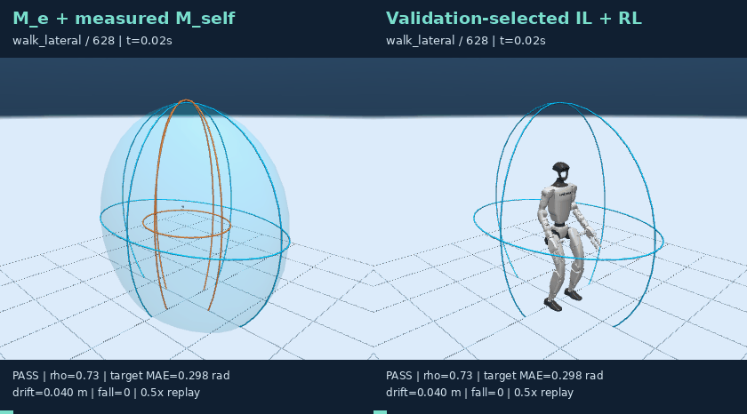](media/A_000628_walk_lateral.gif) | [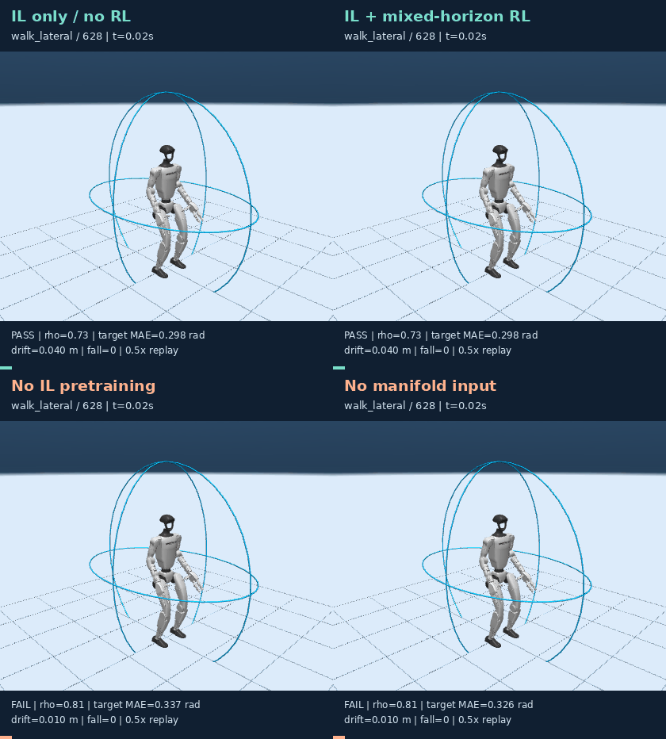](media/B_000628_walk_lateral.gif) |
| turn_in_place / 1031 | [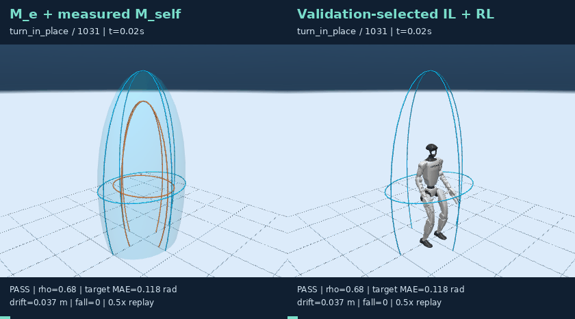](media/A_001031_turn_in_place.gif) | [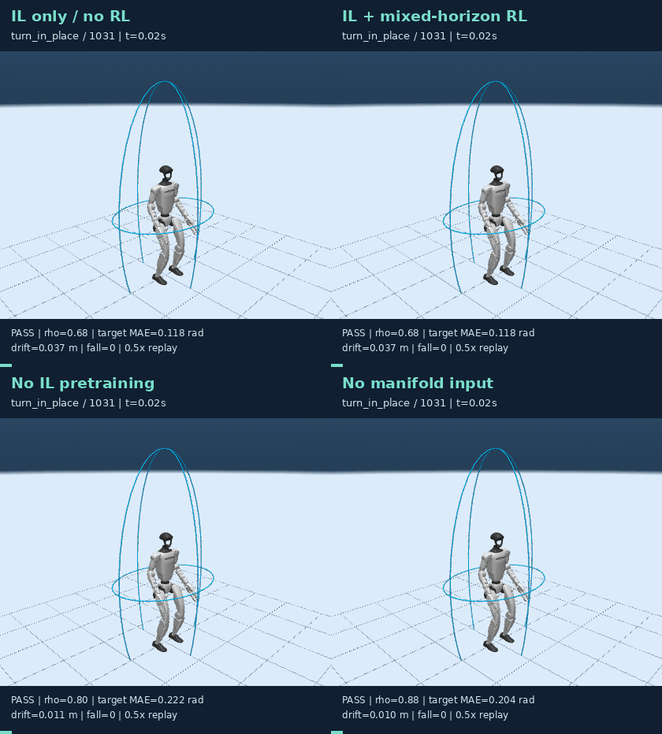](media/B_001031_turn_in_place.gif) |
| crouch_walk / 1278 | [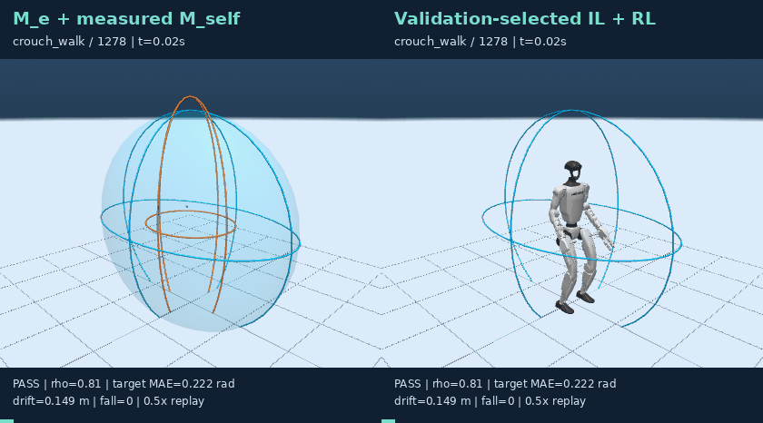](media/A_001278_crouch_walk.gif) | [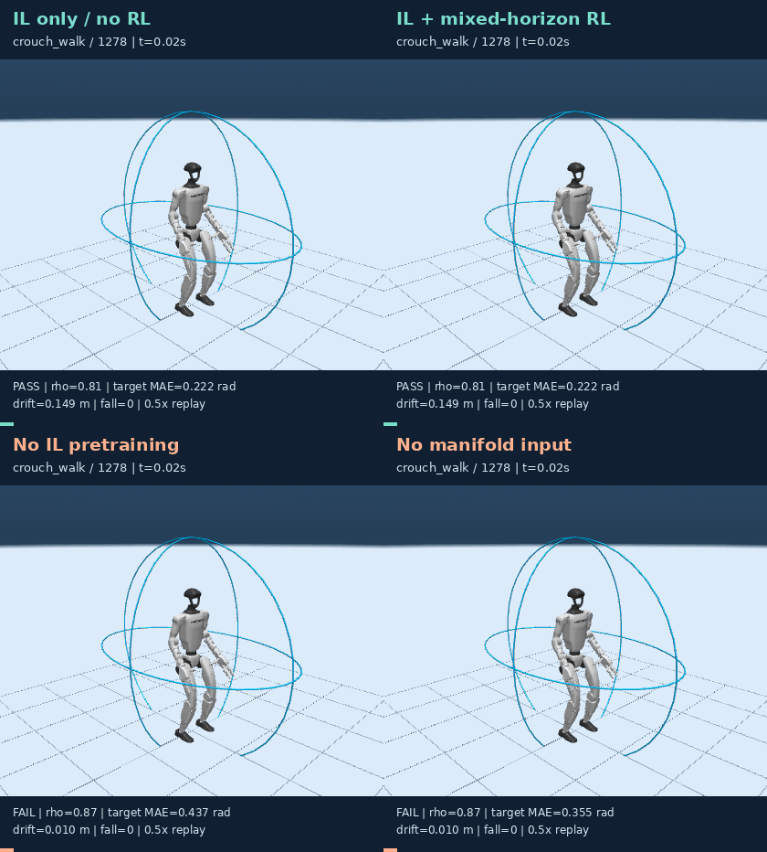](media/B_001278_crouch_walk.gif) |
| forward_lunge / 1817 | [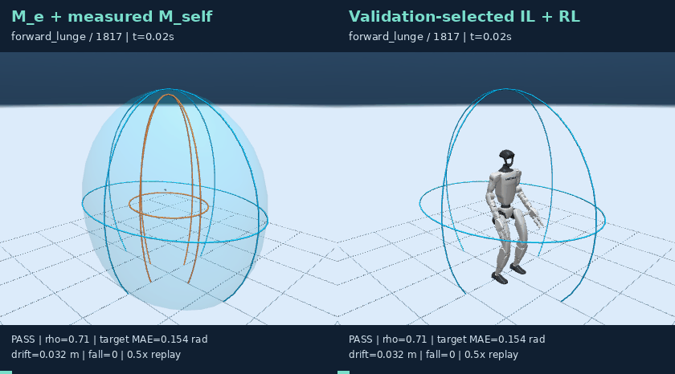](media/A_001817_forward_lunge.gif) | [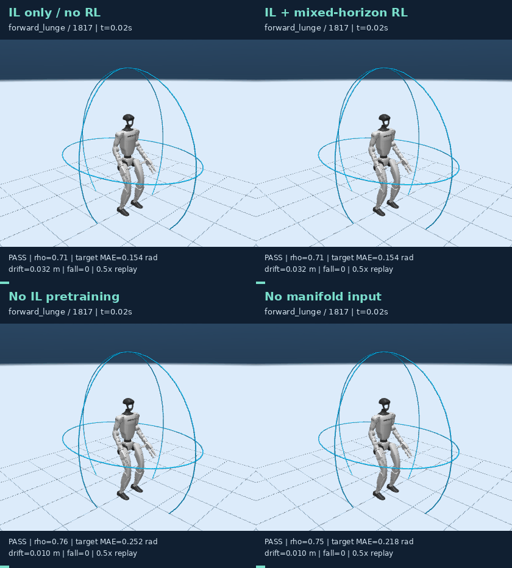](media/B_001817_forward_lunge.gif) |
| all_fours / 2856 | [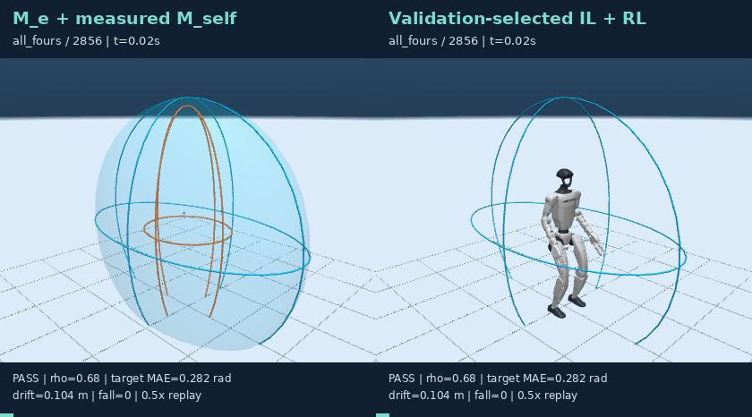](media/A_002856_all_fours.gif) | [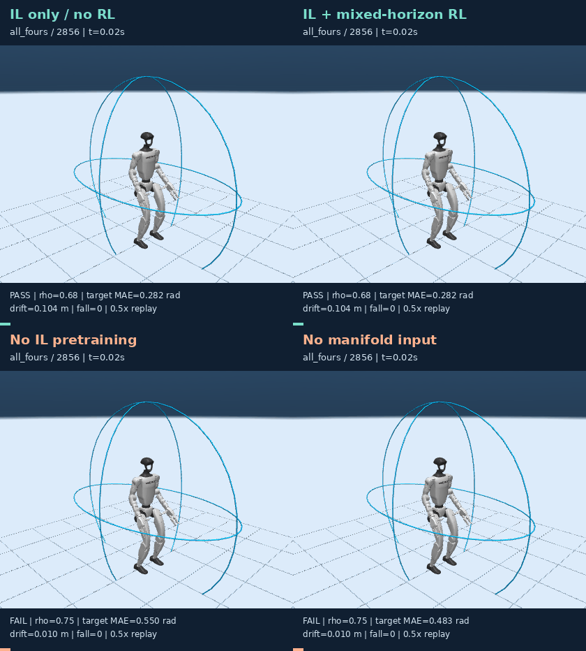](media/B_002856_all_fours.gif) |
| carry_object / 3570 | [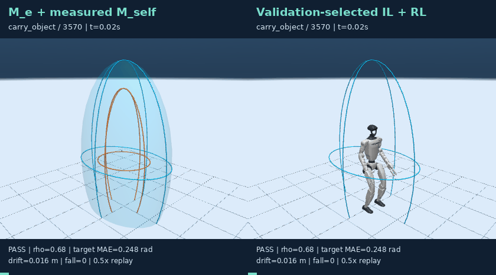](media/A_003570_carry_object.gif) | [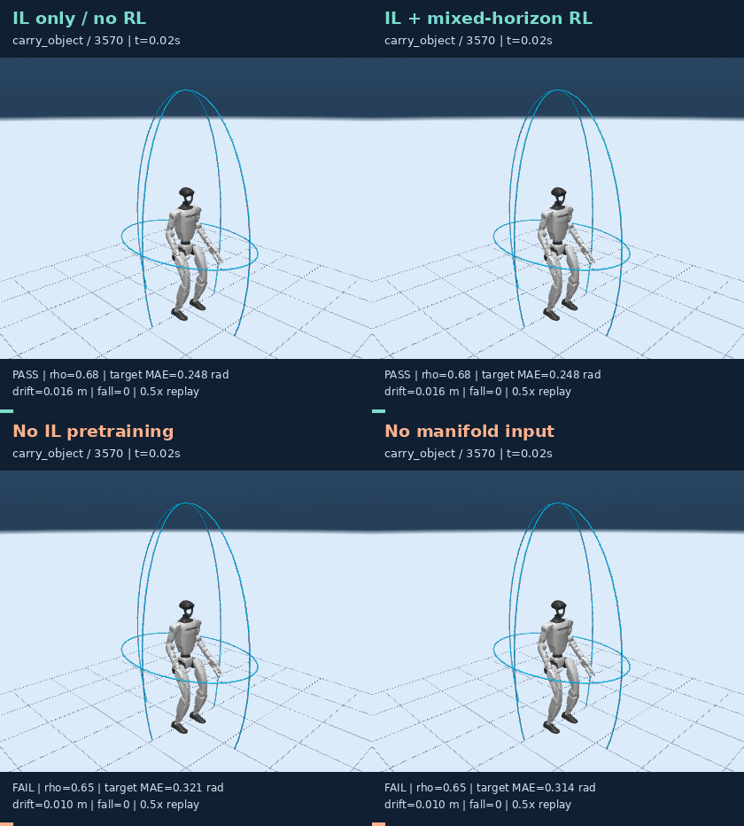](media/B_003570_carry_object.gif) |

## 复现

依赖现有 WSL 环境、SONIC ONNX、本地 SEED 派生 NPZ 和 v3 模仿权重。三个种子最多并行三个进程，单进程两线程；不修改默认在线控制器。

```bash
seed=20260928
OMP_NUM_THREADS=2 OPENBLAS_NUM_THREADS=2 ./scripts/python.sh -m manifold_motion.stage1.mixed_suite --seed "$seed"
OMP_NUM_THREADS=2 OPENBLAS_NUM_THREADS=2 ./scripts/python.sh -m manifold_motion.stage1.mixed_evaluate --seed "$seed"
# 另外两个种子同样运行，然后：
MUJOCO_GL=egl ./scripts/python.sh -m manifold_motion.stage1.mixed_report
```

精确相同动作的确定性回放会复用缓存，并记录 execution_source；代表窗口仍重新执行并与旧指标逐项核对。缓存不参与动作选择。
训练模型保存于 `reports/manifold_motion/stage1_mixed_v5/seed_<seed>/<variant>/residual.pt`；不会覆盖 v3/v4。
