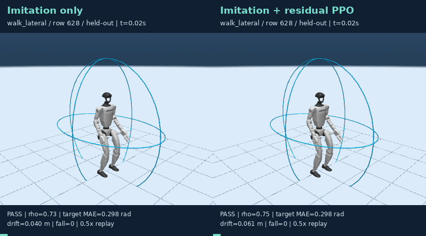
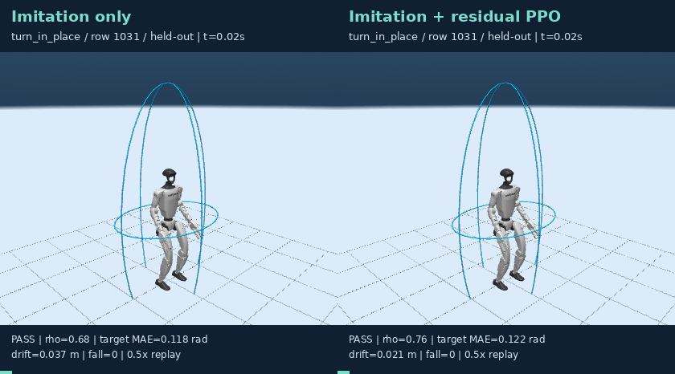
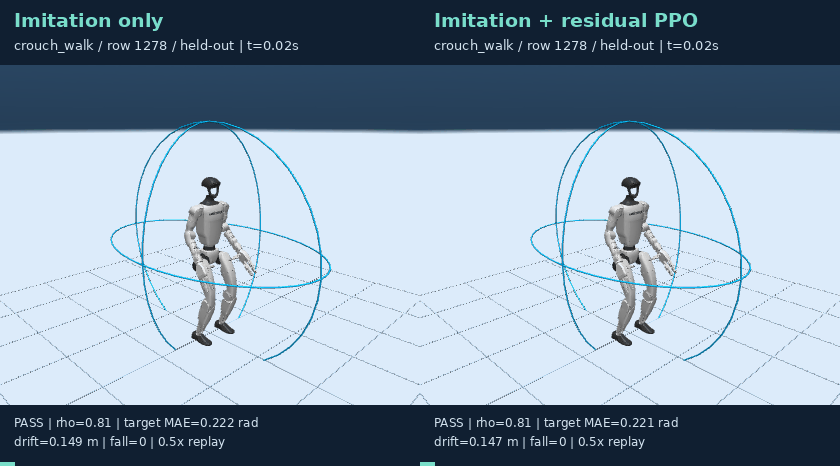
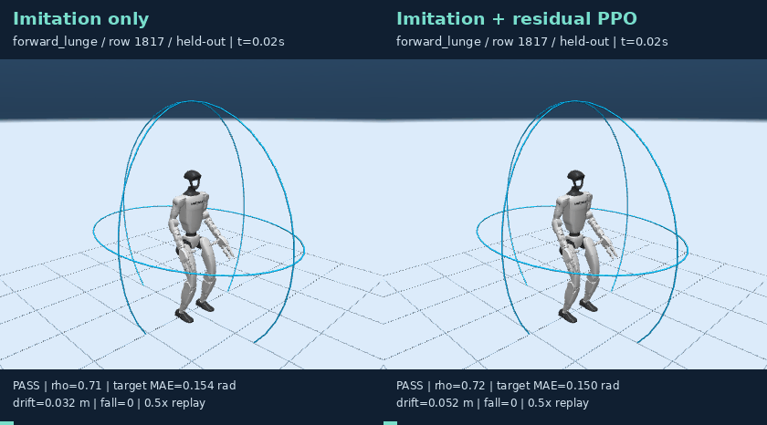
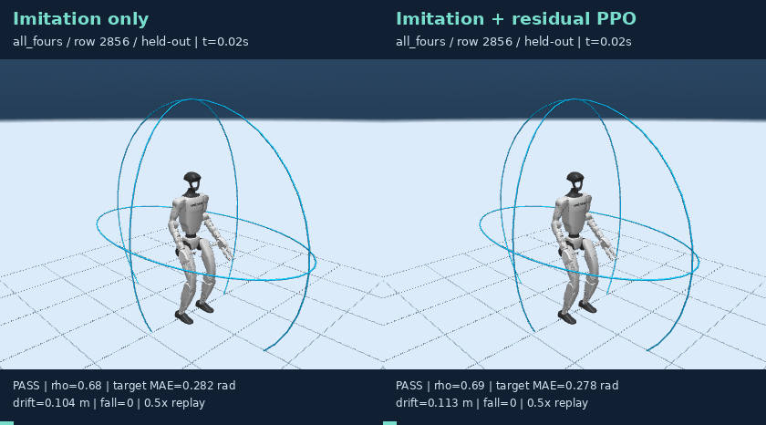
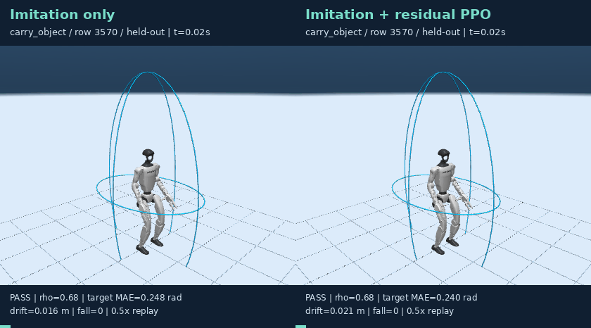

# Stage 1：有界残差 RL 优化

这是对 [v3 负结果](../stage1_ab_response_v3/README.md) 的后续探索性算法修订。旧结果保留，不重命名、不用其他方法的输出冒充 RL。SONIC 仍然冻结。

**使用状态：研究用候选，未替换默认策略。** 短时目标误差改善不能抵消安全指标退化；特别要查看下方长保持诊断，不能仅挑选短时图表宣称全面提升。

## 算法与奖励

- 冻结模仿网络；以其输出为基线，用仅由训练集构造的 12 维 PCA 基底表达关节修正，每个关节修正严格限制在 ±0.35 rad。该基底只是残差参数化，不是已放弃的 latent prior 路线。
- 同一流形采样 4 个独立候选，以其余候选奖励均值为基线；减少不同任务难度混入优势估计。
- 每批执行 4 次 PPO 更新；KL 超过 0.03 时回滚超限的一步。
- 奖励直接使用真实执行后的目标误差，移除可能阻碍误差补偿的指令跟踪惩罚；连续惩罚越界和漂移，单独惩罚跌倒/非脚触地。
- 每种子 60 × 8 × 4 = 1,920 个训练 episode。验证集选模要求实际目标 MAE 不恶化，门控通过率下降不超过预先固定的 2 个百分点；测试指标和阈值不变。

```text
r = -5 * executed_target_MAE -10 * max(radius - 0.95, 0)^2
    -0.25 * (min(drift, 1)/0.35)^2 -4 * fall -1 * nonfoot_contact
```

本轮同时修改残差结构、奖励与更新方式，不能将变化单独归因于某一项。旧测试集已被查看过；本轮虽未用其选模，仍应作为开发集上的探索性复测，论文定稿需要新增未看过的 actor/场景确认集。

## 训练与来源审计


[完整协议、训练曲线数值与权重 SHA256](training_audit.json)。更新前为零残差，等价于原始模仿策略；零迭代权重允许被保留，绝不保证训练一定提升。

| Seed | 验证集选择的 RL 迭代 | 训练 episode |
|---|---:|---:|
| 20260928 | 60 | 1920 |
| 20260929 | 60 | 1920 |
| 20260930 | 60 | 1920 |

## B：同指标、同初态的配对测试

每方法、每种子 727 个窗口。预热 0.2 秒，过渡 0.2 秒，保持 0.4 秒。成功定义仍为形状/触地/跌倒/漂移门控通过且目标关节平均误差 ≤0.30 rad。


| 方法 | 执行目标 MAE ↓ | 短时姿态成功率 ↑ | 门控通过率 ↑ | 跌倒率 ↓ |
|---|---:|---:|---:|---:|
| Imitation only | 0.2184 ± 0.0003 | 84.27 ± 0.21% | 96.70 ± 0.14% | 0.00 ± 0.00% |
| Imitation + residual PPO | 0.2139 ± 0.0009 | 84.69 ± 0.88% | 96.38 ± 0.29% | 0.00 ± 0.00% |

种子均值上的 actor 成簇配对 bootstrap（RL−IL，95% CI）：

- `pose_success`：差值 +0.00413，CI [-0.01058, +0.01722]；23 个测试 actor。
- `accepted`：差值 -0.00321，CI [-0.01029, +0.00659]；23 个测试 actor。
- `target_mae`：差值 -0.00451，CI [-0.00729, -0.00217]；23 个测试 actor。


所有来源族都保留在图中，含退化项；MAE 减小与安全通过率提升不是同一结论。各种子、各来源族指标见 [summary.json](summary.json)。

## A：新执行对比（不是旧 GIF）

固定展示 seed 20260928，六个预先指定来源族各取最早测试窗口；不按成功筛选。左侧 IL，右侧 IL＋残差 RL。同一输入流形、同一初态，均为新 SONIC/MuJoCo 执行。字幕为全 episode 指标，0.5 倍速。

流形椭球仍为骨盆中心、航向对齐的形状检查，不是固定世界障碍物。来源名称不是完整动作成功证明，PASS 也不代表完成爬行/绕障任务。

| 来源 / 样本 | 同步对比 |
|---|---|
| walk_lateral / 628 | [](media/compare_000628_walk_lateral.gif) |
| turn_in_place / 1031 | [](media/compare_001031_turn_in_place.gif) |
| crouch_walk / 1278 | [](media/compare_001278_crouch_walk.gif) |
| forward_lunge / 1817 | [](media/compare_001817_forward_lunge.gif) |
| all_fours / 2856 | [](media/compare_002856_all_fours.gif) |
| carry_object / 3570 | [](media/compare_003570_carry_object.gif) |

## 长保持诊断

固定全部 19 个测试来源族各一窗 × 3 个种子；0.4 秒预热、0.4 秒过渡、3 秒保持。只是诊断子集，不替代完整长时任务测试。

| 方法 | 样本 | 门控通过 | 姿态成功 | 跌倒 |
|---|---:|---:|---:|---:|
| Imitation only | 57 | 100.0% | 87.7% | 0.0% |
| Imitation + residual PPO | 57 | 93.0% | 82.5% | 0.0% |

[逐窗诊断记录](long_hold.json)


## 结论边界与下一步

- 本版本比较相同模仿起点有无残差 RL；还不是新版本完整的去模仿/去几何/去新奖励消融。旧版本不同训练器的对照不能直接充当这些消融。
- 优先下一步：训练和验证都加入混合执行时域（短时＋3 秒保持），采用安全优先的选模约束。当前只对短时奖励训练，不能期待长时稳定性自动改善。随后再做同预算继续模仿、旧奖励＋新更新器、新奖励＋旧更新器等对照，分离各项贡献。
- 将最终方案锁定后，用新的未见 actor/场景确认集验证；不要持续根据已看过的测试集调参。
- 若目标是窄通道侧身、低障碍蹲走，应使用固定世界障碍物、实际身体包络和任务进展评估；不是要求每个输入都拟合某个唯一的源姿态。爬行/跪姿的合法接触也应单独定义，不能沿用只允许脚触地的站立门控。

## 复现

使用现有 WSL、SONIC、SEED 派生 NPZ 及 actor 元数据；先完成 v3 的模仿训练。不要将更新后的权重覆盖到旧实验目录。

```bash
seed=20260928
base=reports/manifold_motion/stage1_ab_response_v3/replicate_${seed}/seed_${seed}/imitation.pt
out=reports/manifold_motion/stage1_residual_rl_v4/seed_${seed}
OMP_NUM_THREADS=2 OPENBLAS_NUM_THREADS=2 ./scripts/python.sh -m manifold_motion.stage1.residual_rl train --seed "$seed" --base "$base" --out "$out"
# 训练/验证确定方案后，才执行测试：
OMP_NUM_THREADS=2 OPENBLAS_NUM_THREADS=2 ./scripts/python.sh -m manifold_motion.stage1.residual_rl evaluate --base "$base" --out "$out"
# 对另外两个种子重复，再生成报告：
MUJOCO_GL=egl ./scripts/python.sh -m manifold_motion.stage1.residual_report --long-check
```
