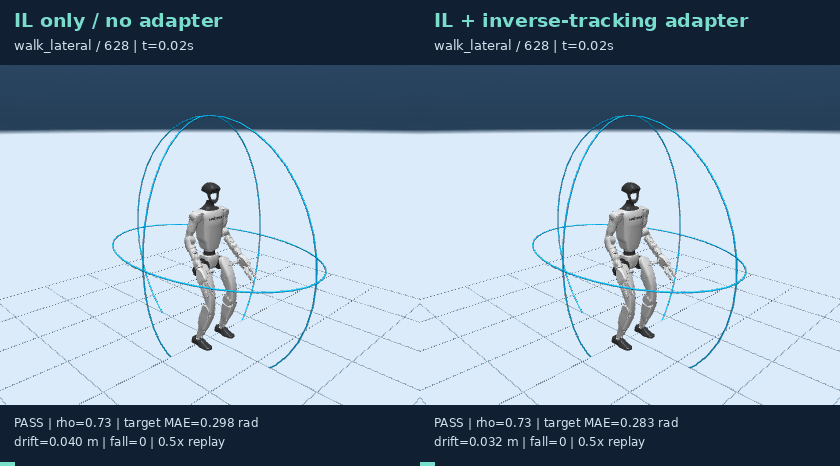
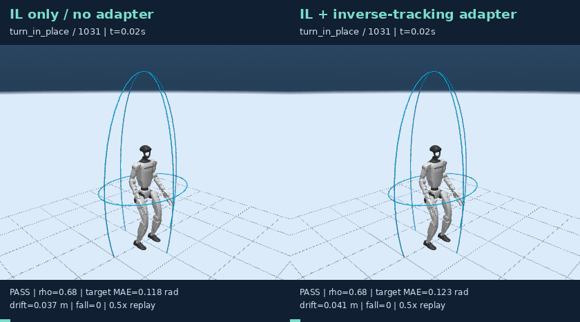
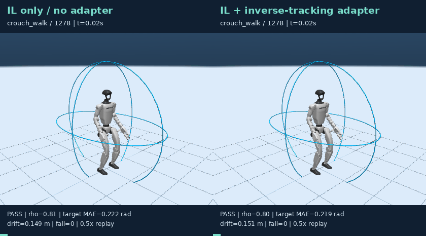
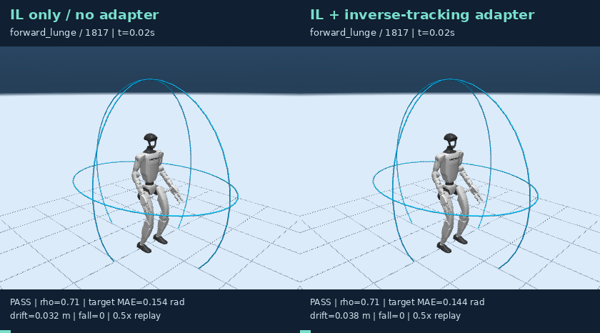
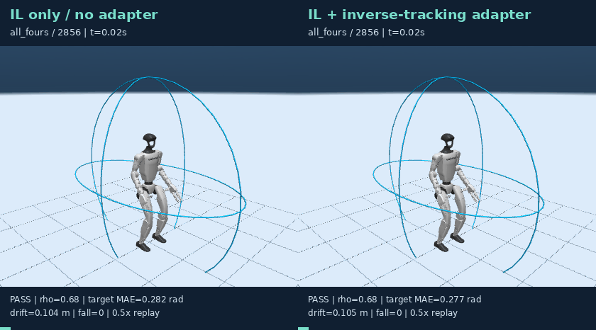
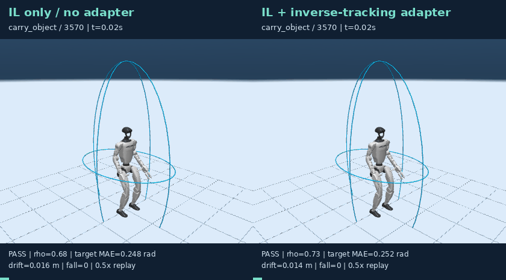

# Stage 1：SONIC 逆跟踪适配器

本实验在冻结 SONIC ONNX 的条件下，使用训练集物理回放测量“IL 请求姿态 − 实际保持姿态”，通过短时与 3 秒长时候选筛选后，训练一个只读取 `M_e` 与 IL 输出的有界残差适配器。SEED 目标只用于物理候选奖励与安全筛选，不作为在线残差标签。

## 三种子测试结果

| 时域 | IL only 目标 MAE | 适配器目标 MAE | IL 安全门控 | 适配器安全门控 | IL 姿态成功 | 适配器姿态成功 |
|---|---:|---:|---:|---:|---:|---:|
| 短时全 727 窗口 | 0.2184 ± 0.0003 | 0.2169 ± 0.0018 | 96.6988 ± 0.1376% | 96.5612 ± 0.2382% | 84.2733 ± 0.2101% | 84.5942 ± 0.1376% |
| 长时固定 38 窗口 | 0.1904 ± 0.0013 | 0.1894 ± 0.0016 | 95.6140 ± 1.5193% | 95.6140 ± 1.5193% | 86.8421 ± 2.6316% | 88.5965 ± 4.0198% |


## 冻结协议与 seed 选择

- 三个 actor-disjoint seed：20260928 / 20260929 / 20260930。训练集每来源族 4 个窗口，短时和 3 秒长时都参与候选物理筛选。
- 腿部残差固定为 0；腰部最多 ±0.04 rad；手臂最多 ±0.24 rad。在线只使用流形特征和 IL 输出。
- 候选为 0×、0.5×、1.0×请求-实际误差；原本安全的 rollout 不允许因修正变成不安全。缩放值只在 validation 选择，test 未参与。
- 各 seed 选择的缩放：20260928 → 1.00×, 20260929 → 0.00×, 20260930 → 0.25×。
- 20260929 validation 未通过严格门控，因此选择 0×并等价于 IL；该 seed 没有被隐藏。
- 该实验显示短时 MAE 平均下降，但短时安全率存在约 0.14 个百分点的 test 波动；长时安全率保持。它是 simulator-aware 改善证据，不是已经完成的实机验证或 SOTA 声明。

- 当前 split=2 已在 v3–v5 中被查看，因此本页属于 development-test；论文结论仍需新 actor / 新物理场景的未查看 confirmation set。

## A/B MuJoCo 回放

| 来源 | IL 与逆跟踪适配器同步对照 |
|---|---|
| walk_lateral / 628 | [](media/B_000628_walk_lateral.gif) |
| turn_in_place / 1031 | [](media/B_001031_turn_in_place.gif) |
| crouch_walk / 1278 | [](media/B_001278_crouch_walk.gif) |
| forward_lunge / 1817 | [](media/B_001817_forward_lunge.gif) |
| all_fours / 2856 | [](media/B_002856_all_fours.gif) |
| carry_object / 3570 | [](media/B_003570_carry_object.gif) |

## 复现

```bash
seed=20260928
OMP_NUM_THREADS=2 OPENBLAS_NUM_THREADS=2 ./scripts/python.sh -m manifold_motion.stage1.simulator_adapter --seed "$seed" --base reports/manifold_motion/stage1_ab_response_v3/replicate_${seed}/seed_${seed}/imitation.pt --out reports/manifold_motion/stage1_sim_adapter_v9_tracking/seed_${seed}
OMP_NUM_THREADS=2 OPENBLAS_NUM_THREADS=2 ./scripts/python.sh -m manifold_motion.stage1.simulator_adapter --evaluate --seed "$seed" --base reports/manifold_motion/stage1_ab_response_v3/replicate_${seed}/seed_${seed}/imitation.pt --out reports/manifold_motion/stage1_sim_adapter_v9_tracking/seed_${seed}
```

[逐 seed 测试摘要](summary.json) · [协议与训练审计](audit.json)
