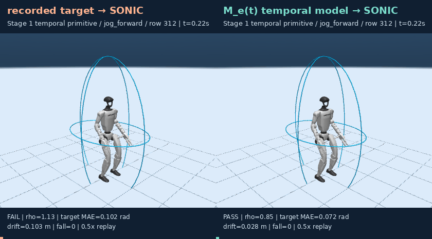
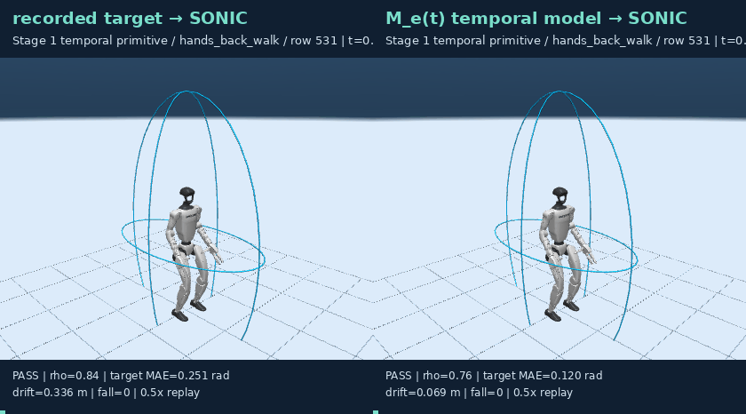

# Stage 1：时序原语实验

本实验冻结 SONIC，只训练上层时序原语头。网络只读取 `M_e(t)` 的 36 帧、7 维椭球序列，不读取 primitive 标签、自身未来流形或目标动作。

## 多 seed 确认结果

三个独立初始化种子均使用相同的 1,587 train、1,151 validation 和 523 actor-held-out
confirmation 窗口。每个种子只通过 validation 选模。

| metric | mean ± seed SD |
|---|---:|
| confirmation joint MAE ↓ | **0.1936 ± 0.0031 rad** |
| confirmation velocity MAE ↓ | **0.0254 ± 0.0009 rad** |
| action-family top-1 ↑ | **39.8 ± 5.8%** |

全局时序均值基线 confirmation MAE = **0.2227 rad**。逐 seed 数字、固定协议和物理
结果见 [multi_seed.md](multi_seed.md) 与 [multi_seed.json](multi_seed.json)。

## 物理回放

扩展物理确认按每个动作族均匀选择 3 窗，共 42 窗/seed。预测序列的门控通过率为
**88.1 ± 2.4%**，冻结 SONIC 跟踪 MAE 为 **0.0889 ± 0.0016 rad**。记录目标在相同
42 窗上的门控通过率为 **69.0%**；失败主要来自源动作本身超出反向构造的静态包络或
根漂移。这是短时 executor gate，不是完整导航成功率。

下表保留 seed 20260928 的六个同步 GIF，扩展物理集没有按结果挑选 GIF。

| family | temporal model GIF |
|---|---|
| jog_forward |  |
| hands_back_walk |  |
| walk_lateral |  |
| walk_curve |  |
| dodge_lateral |  |
| forward_lunge |  |

## 边界

模型预测 29 个关节序列；根位置/根旋转仍由后续 Stage 2 动态模型负责。确认集由 actor hash 在训练完成前固定划分，不能与已查看的 development test 混用。SONIC ONNX 权重没有被修改；本实验的适配对象是上层原语模型。
