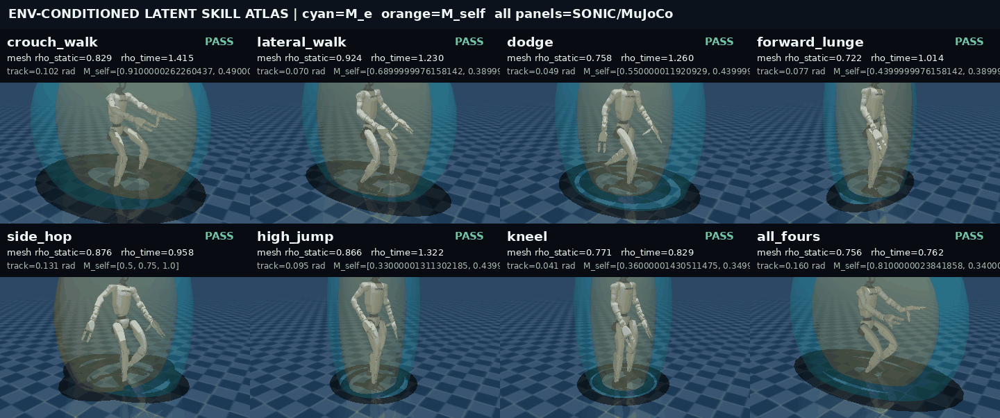

# Environment-conditioned latent skill prior

This is the first result in this repository that actually executes samples from the latent
prior. The older wide-versus-low GIF remains a useful geometry-router baseline, but its crouch
was selected deterministically and must not be cited as evidence for LATENT.

## Model and data contract

Version 6 trains on the actor-disjoint, reverse-corridor SEED windows and predicts the trajectory
that frozen SONIC actually executed:

```text
p(z | state, 12-frame history, skill family, M_e corridor/SDF, M_self, command)
                                  |
                                  v
                         decoded target_exec
                                  |
                                  v
            latent barrier -> projection -> SONIC -> MuJoCo -> mesh gate
```

The direct prior mean is supervised during training; a good posterior reconstruction is no
longer allowed to hide an unusable online prior. Root translation has loss weight 4 and the
lower body has weight 2. On 727 actor-disjoint test windows, prior MSE is 0.674 versus the zero
baseline's 1.346, a 49.9% relative improvement.

```bash
./scripts/python.sh -m manifold_motion.stage2.latent_prior train \
  --windows reports/manifold_motion/seed_capability_windows_corridor_v1/seed_stage2_windows.npz \
  --out reports/manifold_motion/skill_prior_environment_v6_exec \
  --epochs 60 --batch-size 64 --latent-dim 32 --condition-hidden 128 --hidden 256 \
  --learning-rate 0.0003 --beta 0.001 --prior-reconstruction-weight 1.0 \
  --root-weight 4.0 --lower-body-weight 2.0 --model-target-field target_exec --device cpu
```

## Physical candidate gate

`scripts/probe_latent_candidates.py` samples the state-conditioned prior, applies the latent
barrier and optimization projection, then runs every candidate through frozen SONIC and MuJoCo.
The gate checks joint limits, tracking, fall/roll/contact conditions and the exact G1 mesh
against the conditioned corridor.

For a static scene, the safe corridor is the **union** of its ellipsoids. The hard radius is
therefore `max_surface min_corridor_element rho`. The older time-index pairing rejected a safe
but slower robot as if progress lag were a collision. Both values remain in every report:

- `corridor_radius_spatial_union_max`: static-scene hard gate;
- `corridor_radius_temporal_max`: moving-obstacle/time-synchronized diagnostic and hard gate
  when `--corridor-mode temporal` is requested.

The held-out crouch probe at source index 1278 accepts 8/8 stochastic candidates. Their static
mesh radii are 0.820–0.838, mean joint tracking errors are 0.100–0.103 rad, with no fall or
obstacle contact. The corresponding temporal radii expose SONIC's root-progress lag and are not
silently discarded.

## Multi-skill visual audit



The atlas executes eight decoded families: crouch walk, lateral walk, lateral dodge, forward
lunge, side hop, high jump, kneel and all fours. Cyan is the nearest environment manifold
element `M_e`; orange is `M_self` refitted from the actual MuJoCo state on every frame. All eight
short probes pass their static corridor and physical gates; the largest mesh radius is 0.924 and
the largest mean tracking error is 0.160 rad. Exact rows are in
[`latent_skill_atlas_v6.json`](../demo_gallery/media/latent_skill_atlas_v6.json).

This atlas demonstrates real latent decoding and family diversity, not autonomous long-horizon
composition. The next required ablation is the same unseen long task with LATENT disabled versus
enabled, including at least two non-crouch switches and temporal screening for moving obstacles.
